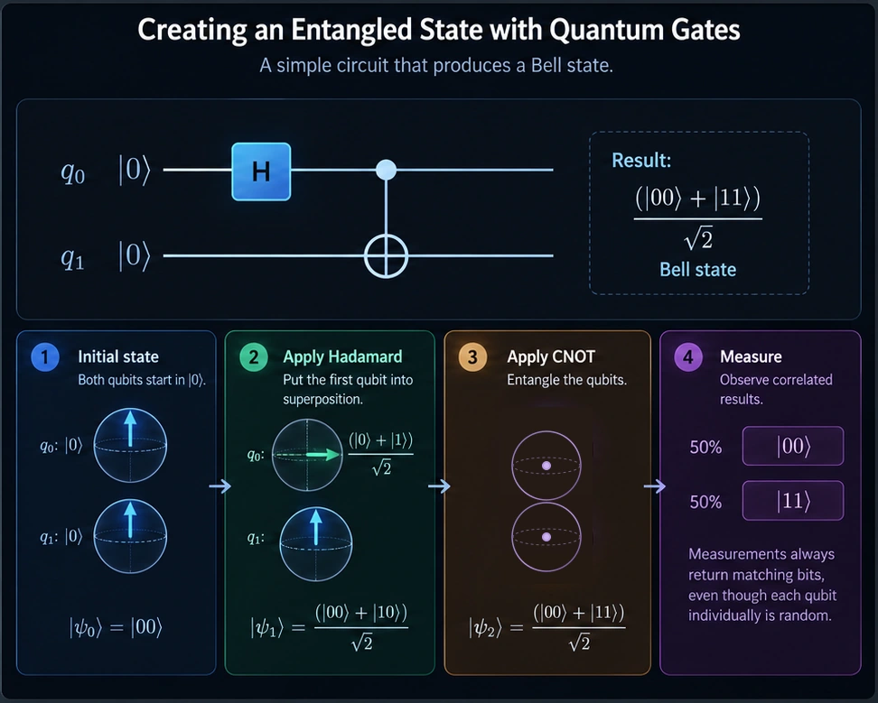

You may spend your day writing Java services, SQL queries, or HTTP APIs without thinking about a transistor. Eventually, though, those abstractions execute as operations on bits in digital circuits. NOT, AND, OR, and XOR are familiar even when the hardware implementing them is out of sight.

What changes when a circuit carries qubits instead? The names and drawings can look familiar: there are wires, gates, and outputs. But a quantum circuit tracks amplitudes and phase, and it produces ordinary bits only when measured. Understanding that shift is more useful than memorizing a catalog of gate symbols.

## Start with the familiar: classical bits

In ordinary digital computation, a bit has a definite logical value, `0` or `1`. A program compiles into instructions; processors realize those instructions with digital circuits; circuits are built from transistors arranged into logic gates. The details of transistor physics matter to hardware designers, but Boolean values are enough for our comparison.

A classical circuit can be described as a function from input bits to output bits. For fixed inputs, a deterministic circuit gives a fixed output. Randomized software and noisy hardware exist, of course; they do not change what an ideal NOT or AND gate means.

## Classical logic gates

NOT flips one bit: `NOT(0) = 1` and `NOT(1) = 0`. AND, OR, and XOR each take two inputs. XOR returns `1` when its inputs differ.

<div class="table-scroll" tabindex="0" role="region" aria-label="Classical logic gate truth table">

|  A  |  B  | AND | OR  | XOR |
| :-: | :-: | :-: | :-: | :-: |
|  0  |  0  |  0  |  0  |  0  |
|  0  |  1  |  0  |  1  |  1  |
|  1  |  0  |  0  |  1  |  1  |
|  1  |  1  |  1  |  1  |  0  |

</div>

These rules compose into larger circuits, just as small functions compose into a program. A gate symbol describes an operation, while the wires show which values feed it. The cover illustration summarizes this classical flow alongside the different quantum flow; its symbols are an overview, not a claim that similarly placed gates do identical jobs.

## Why information can disappear

Suppose an AND gate returns `0`. Its input could have been `00`, `01`, or `10`. From that output alone, you cannot reconstruct the input. OR has a similar ambiguity when it returns `1`. These familiar two-input, one-output Boolean gates are **irreversible** as functions of their stated inputs and outputs.

That does not mean all classical computation is irreversible. NOT is its own inverse. XOR can also be used in reversible constructions if the other inputs are preserved. The distinction matters because a quantum gate acting on an isolated quantum state must have an inverse. Later, the Toffoli gate will show how to retain the inputs while computing AND.

## Enter the qubit

The states `|0⟩` and `|1⟩` are the computational-basis states of a qubit. They are the quantum states that produce definite outcomes when measured in that basis. A general pure qubit state can be written as:

`|ψ⟩ = α|0⟩ + β|1⟩`, with `|α|² + |β|² = 1`.

The symbols `α` and `β` are **amplitudes**. They can be complex numbers, so they contain more information than probabilities alone. If we measure in the computational basis, the probabilities of `0` and `1` are `|α|²` and `|β|²`. The normalization equation says those probabilities add to one.

Calling a qubit “both zero and one at once” leaves out the useful part: the amplitudes, including their relative phase, determine how later operations behave. A single measurement does not reveal both amplitudes. It produces one classical result. Repeating a preparation and measurement can estimate outcome probabilities, but that still does not make an unknown state an ordinary inspectable variable.

## Quantum gates transform amplitudes

An ideal quantum gate applies a **unitary transformation** to the quantum state. It changes amplitudes and phase in a precise, deterministic way. A gate is not a random choice of output bits. The probabilities appear when we measure the resulting state.

For a software engineer, it helps to separate two pipelines:

```text
classical: input bits → Boolean function → output bits
quantum:  prepared state → unitary gates → new state → measurement → bits
```

The quantum middle step can involve superposition and correlations between qubits. It is not just a Boolean function with unfamiliar names.

### Pauli-X: the closest thing to NOT

The Pauli-X gate swaps the basis states: `X|0⟩ = |1⟩` and `X|1⟩ = |0⟩`. On those two inputs, it looks like classical NOT. But X also acts on superpositions. For example, `X(α|0⟩ + β|1⟩) = β|0⟩ + α|1⟩`. The gate transforms the entire state, rather than reading a hidden bit and deciding whether to flip it.

### Hadamard: a gate without a Boolean equivalent

The Hadamard gate, H, acts on the basis states as follows:

```text
H|0⟩ = (|0⟩ + |1⟩) / √2
H|1⟩ = (|0⟩ − |1⟩) / √2
```

Both results give a 50/50 split if measured immediately in the computational basis. The minus sign still matters. It changes the **relative phase** between the two components, which later gates can turn into different measurement probabilities. H is not a probabilistic coin-flip gate: it deterministically prepares a particular state from each input.

### Phase and interference

Compare `|+⟩ = (|0⟩ + |1⟩)/√2` with `|−⟩ = (|0⟩ − |1⟩)/√2`. Both produce `0` and `1` equally often if measured right away in the computational basis. Apply H before measuring, however, and `H|+⟩ = |0⟩` while `H|−⟩ = |1⟩`. The states had the same immediate measurement probabilities, yet a later transformation makes them distinguishable.

That is interference in a small, concrete example. Amplitudes can reinforce or cancel when operations combine them. A phase gate such as Z changes a relative sign; it need not alter immediate computational-basis probabilities to affect what happens later. Algorithms use carefully arranged interference, not superposition alone, to make useful answers more likely. [IBM Quantum’s discussion of relative phase](https://quantum.cloud.ibm.com/learning/en/courses/basics-of-quantum-information/quantum-circuits/limitations-on-quantum-information) develops this distinction further.

## CNOT and two-qubit operations

Controlled-NOT, or CNOT, has a **control** qubit and a **target** qubit. On computational-basis inputs, it flips the target when the control is `1`:

| Input | Output |
| :---: | :----: |
| `00`  |  `00`  |
| `01`  |  `01`  |
| `10`  |  `11`  |
| `11`  |  `10`  |

Each row has a distinct output, so the mapping is reversible. The table does not describe CNOT’s full behavior. Like X and H, it acts linearly on superpositions. A CNOT can create entanglement when given an appropriate superposed input; it does not entangle every possible pair of input qubits.

## From superposition to entanglement

Start with two qubits in `|00⟩`. Apply H to the first qubit, leaving the second alone:

`|00⟩ → (|00⟩ + |10⟩)/√2`.

Now apply CNOT with the first qubit as control and the second as target. The `|00⟩` component stays `|00⟩`; the `|10⟩` component becomes `|11⟩`:

`(|00⟩ + |10⟩)/√2 → (|00⟩ + |11⟩)/√2`.

The result is the Bell state often called `|Φ+⟩`. It is a state of the **pair**, not two independent qubit states that happen to match. Neither qubit has its own pure state before measurement. Considered separately, each is maximally mixed; together they have a definite entangled state.

<figure class="article-figure">



<figcaption>The H–CNOT sequence prepares (|00⟩ + |11⟩)/√2. The centered dots in step 3 represent each qubit’s maximally mixed individual state; measuring the pair in the computational basis yields 00 or 11.</figcaption>

</figure>

In an ideal computational-basis measurement, the pair yields `00` or `11`, each with probability one half. The outcomes are correlated, but that fact alone is not the full definition of entanglement; classical bits can also be correlated. Here the joint state cannot be factored into a state for the first qubit times a state for the second. No faster-than-light message can be sent by choosing to measure one member of the pair. [IBM Quantum’s treatment of Bell states and reduced states](https://quantum.cloud.ibm.com/learning/en/courses/general-formulation-of-quantum-information/density-matrices/multiple-systems) gives the formal account.

## Why quantum gates are reversible

For an ideal isolated system, a quantum gate must preserve the total probability represented by the state and have an inverse. Mathematicians express this with `U†U = I`: applying a gate’s conjugate-transpose inverse, `U†`, after `U` returns the original state. You do not need to calculate the matrices to use the idea.

X, H, and CNOT are each their own inverse. Apply any one of them twice and you get back the original state. This is a property of the ideal gates, not a promise that physical hardware has no noise or that measurement can be undone.

## What about AND, OR, and Toffoli?

An ordinary two-input, one-output AND gate cannot be a quantum gate by itself: multiple inputs map to the same output. But we can embed the calculation in a reversible operation that keeps enough information:

`(a, b, 0) → (a, b, a AND b)`.

The **Toffoli gate**, also called controlled-controlled-NOT, supplies this pattern. For any third input `c`, it maps `(a, b, c)` to `(a, b, c XOR (a AND b))`. With `c = 0`, the third output is `a AND b`; the first two bits are preserved. Apply Toffoli again to the output and the original `c` returns, so the full operation is reversible.

Toffoli is a valid quantum gate and can operate on superpositions as well as basis states. It is a useful bridge: reversible classical computation can live inside a quantum circuit, although doing so requires extra wires or workspace and does not by itself create a quantum speedup. [IBM Quantum explains how Toffoli simulates Boolean operations](https://quantum.cloud.ibm.com/learning/en/courses/fundamentals-of-quantum-algorithms/quantum-algorithmic-foundations/simulating-classical-computations).

## Measurement is a different operation

Measurement is where a quantum circuit yields classical information. For a computational-basis measurement of `α|0⟩ + β|1⟩`, the possible results are `0` and `1`, with probabilities `|α|²` and `|β|²`. In the ideal projective model, the measured state changes to the basis state corresponding to the observed result. Measurement is therefore not just another reversible unitary gate.

This is why `System.out.println(qubit)` is a poor debugging model. Measuring an intermediate qubit is an operation on the computation, not a passive read of a Java variable. Quantum programs often prepare a state, apply many gates, then measure selected qubits and process the resulting bits classically. Some algorithms use intermediate measurements and classical control, but those steps are explicit parts of the circuit.

## Classical and quantum gates at a glance

<div class="table-scroll table-scroll--wide" tabindex="0" role="region" aria-label="Classical and quantum gate comparison">

| Property               | Classical circuit                        | Quantum circuit                                               |
| ---------------------- | ---------------------------------------- | ------------------------------------------------------------- |
| Basic unit             | Bit with a definite logical value        | Qubit described by amplitudes in a chosen basis               |
| Typical operation      | Boolean function on bits                 | Unitary transformation of quantum state                       |
| Reversibility          | Depends on the gate or construction      | Ideal isolated gates are reversible                           |
| Phase and interference | No counterpart in ordinary Boolean logic | Relative phase affects later operations                       |
| Entanglement           | Classical correlations are possible      | Joint states can be nonseparable                              |
| Copying                | A known bit value can be copied          | An arbitrary unknown quantum state cannot be perfectly cloned |
| Reading a result       | Inspect a bit in the model               | Measurement produces classical outcomes and changes the state |

</div>

The copying row needs care. CNOT can copy a computational-basis value into a target initialized to `|0⟩`, but it cannot clone an arbitrary unknown superposition. That limit is the [no-cloning theorem](https://quantum.cloud.ibm.com/learning/en/courses/basics-of-quantum-information/quantum-circuits/limitations-on-quantum-information), not a prohibition on every operation that resembles copying.

## A software engineer’s mental model

Think of a classical program as manipulating values that can normally be inspected between steps. A quantum circuit prepares a state, transforms amplitudes and phase, may create entanglement, and eventually measures to obtain bits. Gates compose like operations in a pipeline, but a measurement is an active step with consequences for later operations.

Neither model replaces the other. Quantum processors are specialized resources controlled by classical systems. Preparing inputs, scheduling circuits, handling measurement results, and much of an application’s business logic remain classical work. Quantum algorithms provide advantages for particular problem families under particular conditions; they are not a general upgrade for every computation.

## Why this matters for cryptography

The distinction between a gate and a measurement helps explain why quantum algorithms are more than “trying all answers at once.” Algorithms arrange transformations so that phase and interference affect what measurements reveal. Shor’s algorithm is one reason engineers need to review the long-term security assumptions behind RSA and elliptic-curve cryptography.

For the migration implications, see [Post-Quantum Cryptography: What Software Engineers Need to Know](/posts/post-quantum-cryptography-engineers/). That article covers ML-KEM, hybrid key establishment, and practical software planning. It belongs to a separate post-quantum cryptography series; this article starts the Quantum Computing Fundamentals series.

## Where to go next

If this model is new, revisit the H gate and the two Bell-state steps until the difference between **state transformation** and **measurement result** feels clear. From there, the Bloch sphere gives a geometric view of a single qubit, while circuit exercises make phase and interference concrete. Entanglement, quantum algorithms, and the cryptographic consequences are easier to approach once those foundations are in place.

For deeper study, [IBM Quantum’s introduction to quantum circuits](https://quantum.cloud.ibm.com/learning/en/courses/basics-of-quantum-information/quantum-circuits/circuits) covers gates and measurements, and its [Bell-state walkthrough](https://quantum.cloud.ibm.com/learning/en/courses/use-a-qc-today/quantum-mechanics-basics) works through the circuit shown here.
