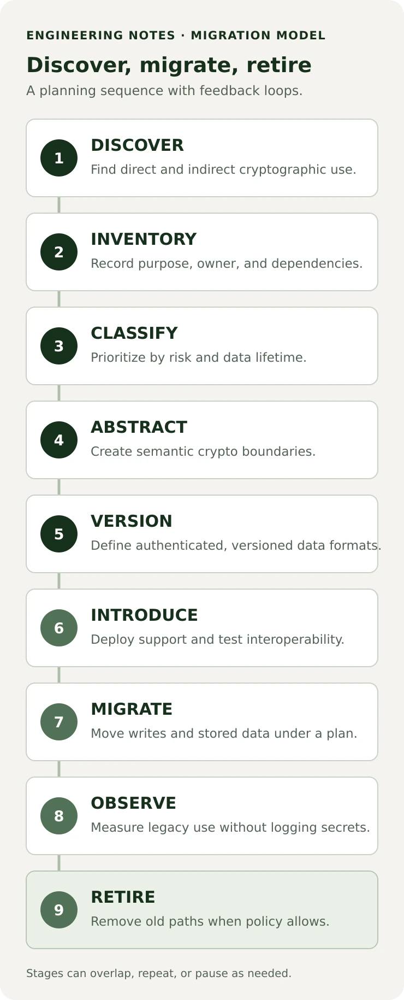

```java
Cipher cipher = Cipher.getInstance(
    "RSA/ECB/OAEPWithSHA-256AndMGF1Padding"
);
```

There is nothing inherently wrong with this Java call. It asks a provider for a named transformation, and an application may have a good reason to use it. The maintenance problem begins when assumptions about RSA keys, padding, ciphertext sizes, encodings, and peer compatibility spread through services, database rows, and API contracts. What happens when the scheme protecting that data needs to change?

In [Part 1](/posts/post-quantum-cryptography-engineers/), we looked at why post-quantum migration matters. [Part 2](/posts/inside-ml-kem/) explained how ML-KEM establishes shared keying material. This article moves up a layer: how can a Java application make cryptographic change manageable without allowing unsafe algorithm switching?

The short answer is that migration is an architecture problem as well as an algorithm problem. Teams need to find where cryptography is used, distinguish application intent from implementation, version persisted formats and protocols, test mixed-version operation, and eventually retire old paths. The examples below are architectural patterns, not a cryptographic protocol specification.

## What crypto agility actually means

NIST’s [final CSWP 39 update](https://csrc.nist.gov/pubs/cswp/39/upd1/considerations-for-achieving-crypto-agility/final), updated June 29, 2026, describes crypto agility as the capabilities needed to replace and adapt cryptographic algorithms in protocols, applications, software, hardware, firmware, and infrastructure while preserving security and ongoing operations. In everyday engineering terms, it is the ability to change cryptography without an unnecessary system redesign or service interruption.

That can involve more than swapping an algorithm implementation. Keys, certificates, protocols, stored data, clients, provider libraries, and hardware may all have to change together. A Java service may compile after an algorithm update while old database records remain unreadable or a downstream consumer still rejects the new envelope. Interoperability and operational continuity are part of the work.

Agility is not an `application.yml` property that accepts any algorithm string. Arbitrary choice can make a system configurable while making its security policy weaker or inconsistent. Safe agility is controlled: supported suites are explicitly approved, versions have defined meanings, selection follows policy, behavior is tested, and usage is observable. It also includes the ability to stop writing and later remove obsolete cryptography.

## The hard-coded cryptography problem

Cryptographic assumptions often hide in places that do not look like cryptography at first:

- A service constructs a `Cipher`, `KeyPairGenerator`, or `Signature` directly.
- A DTO is named `rsaEncryptedKey`, or a REST schema permits only an RSA-shaped field.
- A database column or message frame assumes a fixed ciphertext or key length.
- A file format has no version or suite identifier because there has only ever been one.
- A test asserts one provider’s encoded-key bytes rather than the contract the application needs.
- TLS, JWT/JWS validation, SSH, a KMS, a database driver, or a vendor SDK chooses cryptography outside the application repository.

Changing RSA to ML-KEM is not a search-and-replace task. ML-KEM is a key encapsulation mechanism, not a direct replacement for every RSA use. RSA might be involved in key transport, signatures, certificate chains, or a library’s specific encryption format. Each use has different semantics and a different migration path. A cryptographic inventory must record what a primitive does, not merely where its name appears.

## Step 1: Find your cryptography

Start with discovery, not with an abstraction rewrite. NIST’s [NCCoE Migration to PQC project](https://www.nccoe.nist.gov/applied-cryptography/migration-to-pqc) treats cryptographic discovery and inventory as a workstream: teams need to learn where and how cryptography protects important systems and data, then use that understanding to prioritize migration. Its [migration FAQ](https://pages.nist.gov/nccoe-migration-post-quantum-cryptography/) describes an inventory as including algorithms, protocols, keys and certificates, dependent systems, and protected data.

Search source code and dependency manifests, but also examine the runtime and infrastructure around the code:

- TLS termination, certificates, trust stores, and service-to-service connections
- JWT/JWS, code signing, SSH, VPNs, and client authentication
- encrypted database fields, object storage, files, backups, and message payloads
- cloud KMS/HSM integrations, Java keystores, secrets managers, and provider configuration
- message brokers, API clients, third-party SDKs, container images, build and deployment pipelines

The point is not to create a list of `RSA` strings and call it complete. For each use, capture its purpose, owner, implementation/provider, protocol or format, key lifecycle, dependent systems, data protected, and required confidentiality lifetime. Note whether the use is direct or hidden behind a service. A scanner can surface candidates; engineers still need to map those findings to business assets and compatibility requirements.

| Area     | Example use                           | Migration question                                                               |
| -------- | ------------------------------------- | -------------------------------------------------------------------------------- |
| TLS      | Server identity and key establishment | Which runtimes, clients, proxies, and protocol versions interoperate?            |
| JWT/JWS  | Token signatures                      | Which issuers, verifiers, key formats, and token lifetimes are involved?         |
| Database | Encrypted columns                     | Can older records be read after the format and key scheme change?                |
| Files    | Envelope encryption                   | Are headers versioned, and can archives be rewritten safely?                     |
| Queues   | Encrypted events                      | Can old and new consumers handle both message versions?                          |
| KMS/HSM  | Key generation and storage            | Do the service, provider, hardware, and export formats support the target suite? |

This is a starting inventory, not an exhaustive taxonomy. Prioritize by the sensitivity and lifetime of protected data, exposure, deployment dependencies, and the cost of transition. Do not confuse a code search with a risk assessment.

## Step 2: Separate intent from algorithm

Application code should express what it needs: establish shared keying material, encrypt authenticated data, sign a statement, verify a signature, derive a key, or generate random values. Those operations are not interchangeable, but they can be clearer seams than repeating a concrete algorithm choice throughout business services.

For example, a service that needs to establish key material could depend on a purpose-specific interface:

```java
// Conceptual application boundary, not a standard Java API.
public interface KeyEstablishment {
    EncapsulationResult encapsulate(RecipientKey recipient);

    SecretKey decapsulate(
        DecapsulationKey recipientKey,
        Encapsulation encapsulation
    );
}
```

The types here are illustrative application types. The interface does not define key authentication, wire encoding, protocol negotiation, KDF behavior, or error handling. A real system must use a reviewed protocol and a maintained cryptographic implementation.

The design goal is not to hide every detail as `byte[]`. A `KeyEstablishment` boundary should not also become a file-encryption API or a signature-verification API. Key establishment, AEAD, digital signatures, hashing, and key derivation have different security semantics. Preserve those boundaries so reviewers can reason about each operation.

## Step 3: Select approved suites through policy

Protocols combine compatible choices: a KEM, key schedule or KDF, authenticated encryption, signature and certificate rules, encodings, and parameters. A suite identifier can name one reviewed combination, rather than letting each deployment independently mix strings that may not work together.

```java
// Conceptual identifiers, not standards or production recommendations.
public enum CryptoSuiteId {
    LEGACY_V1,
    PQC_HYBRID_V2
}
```

A policy layer can decide which suites are allowed for new writes, which old formats may still be read, and whether a deprecated suite is rejected. The exact suite definitions belong to the protocol or application format. They must not be inferred from a user-controlled string or selected by silent fallback.

Conceptually, the dependencies look like this:

```text
Business services
        ↓ semantic operation
Crypto API
        ↓ approved request
Crypto policy → suite registry
                      ↓
             selected implementation
                      ↓
                JCA provider
```

Business logic owns product behavior. The crypto API defines meaningful operations. Policy constrains use according to environment and migration state. A suite registry maps allowlisted identifiers to reviewed configurations. Providers implement cryptographic services behind Java’s provider architecture. A provider is an implementation mechanism, not the organization’s security policy, and a provider being available does not make every protocol composition safe.

This is a small boundary, not a reason to create one `CryptoService.doCrypto(...)` method. Avoid both extremes: concrete algorithm assumptions in every business service, and a generic wrapper that erases the distinction between key establishment, encryption, and signatures.

## Step 4: Version encrypted data and authenticate its context

Persisted ciphertext may need to remain readable longer than the service that created it. A format needs enough information to interpret each record after an algorithm or key changes. A conceptual envelope might contain:

```text
formatVersion
suiteId
keyId
encapsulation (when the selected KEM uses one)
nonce
ciphertextAndAuthenticationTag
```

This is an architecture sketch, not a standardized envelope or complete secure protocol. A production format also needs a canonical encoding, strict size limits, precise key and suite semantics, nonce rules, error behavior, and a reviewed definition of which values are authenticated. The fields vary by construction; not every suite has an encapsulation, and some AEAD formats append the tag to the ciphertext.

Treat parsed metadata as untrusted input. It may be necessary to read a version or key identifier before decryption to locate a decoder or key, but that does not make it trustworthy. Validate identifiers against a strict allowlist and bind security-relevant context to authentication. For AEAD, a format may authenticate stable header fields as associated data when its design specifies this. In a negotiated protocol, suite selection and relevant transcript data must be bound according to that protocol. Do not invent a binding scheme ad hoc.

An unauthenticated `suiteId` that can be changed to select a weaker path creates a downgrade risk. A receiver should not silently retry with a weaker algorithm just because the preferred one fails. Where a standard protocol negotiates suites, use its authenticated negotiation and failure rules. For an application envelope, reject unknown or disallowed identifiers explicitly and follow one defined policy.

## Step 5: Support migration without pretending it is atomic

Deployed systems have old clients, stored ciphertext, queues containing delayed events, and application instances that do not all upgrade at once. During a migration, a service may need to **read legacy and new formats while writing only the new format**. This supports rolling deployments without creating more old data.

A common progression is to add a versioned reader, deploy support everywhere, switch approved writes to the new suite, measure legacy reads, and then migrate stored data where the risk and operational cost justify it. Once evidence shows no required consumer depends on the old format, legacy reads can be disabled and the old code and keys retired. The exact order can differ: a protocol change, compliance requirement, key compromise, or client release cycle may require another plan.

Do not assume every historical ciphertext should immediately be decrypted and re-encrypted. Re-encryption can create availability risks, require access to old keys, and change retention obligations. Prioritize according to threat model and data lifetime, preserve recoverability, and test backups and rollback before bulk changes.

Separate three related identifiers:

- **Key identifier:** which managed key or key version is needed.
- **Key material:** the secret or provider-backed object that must be protected.
- **Suite identifier:** the approved cryptographic and format behavior used for this data.

Rotating key A to key B under the same suite is not the same change as moving from a classical format to a PQC or hybrid suite. A KMS/HSM may keep private material non-exportable, but its API, firmware, key type, serialization, and provider still need to support the intended operation. Plan both key lifecycle and algorithm migration.

## Where ML-KEM fits

Part 2 explains the mechanics of [ML-KEM key generation, encapsulation, and decapsulation](/posts/inside-ml-kem/). For architecture, keep one distinction visible: ML-KEM establishes shared secret material; it does not encrypt an application file or replace AES-GCM.

```text
recipient creates an ML-KEM key pair
sender encapsulates to the recipient's authenticated public key
    ├── sender keeps shared secret
    └── sender transmits KEM ciphertext
recipient decapsulates and obtains matching secret material
both sides follow the protocol's key schedule / KDF
derived traffic key → AEAD protects application data
```

The shared secret does not cross the network. The recipient key must be authenticated through the protocol; possession of a valid ML-KEM public key alone does not prove whose key it is. Use the key schedule, transcript binding, and authentication behavior defined by a reviewed protocol. Do not turn this simplified flow into a custom network protocol.

Hybrid key establishment can combine a classical exchange and ML-KEM during migration, but the combiner and protocol context matter. The IETF’s [RFC 10024](https://www.rfc-editor.org/rfc/rfc10024.html), for example, defines specific ML-KEM plus ephemeral ECDH groups for TLS 1.3. This is a protocol-specific standard, not a recipe for concatenating two secrets in application code. Use hybrid support through a protocol implementation that documents the exact standardized groups and deployment support.

## Java’s cryptography architecture and KEM support

Java’s Cryptography Architecture (JCA) separates standard APIs from implementations supplied by security providers. APIs such as `Cipher`, `Signature`, `KeyPairGenerator`, `KeyStore`, and `SecureRandom` request services; providers supply them. The Java security documentation recommends avoiding a hard-coded provider name for general-purpose applications unless provider pinning is an explicit deployment requirement. Pinning can improve control in a specific validated environment, but it also ties the application to that provider and runtime.

The `javax.crypto.KEM` API was introduced in Java 21. It defines encapsulators and decapsulators and is provider-based: `KEM.getInstance("...")` throws `NoSuchAlgorithmException` if no installed provider supports the requested algorithm. **The API existing does not mean every provider implements ML-KEM.**

For a concrete version boundary, Oracle documents ML-KEM support in its JDK providers beginning with JDK 24; current Oracle JDK 26 provider documentation lists ML-KEM and the ML-KEM-512, ML-KEM-768, and ML-KEM-1024 names. Oracle’s Java 26 standard algorithm-name documentation also describes these names. Other Java distributions, providers, FIPS configurations, and hardware-backed deployments can differ. Check the exact runtime and provider in production rather than relying on a successful compile or a developer laptop.

This Java 24+ example uses real JCA method names documented by Oracle. It shows only a KEM exchange and is **not** a complete secure messaging protocol:

```java
KeyPairGenerator keyGenerator = KeyPairGenerator.getInstance("ML-KEM");
keyGenerator.initialize(NamedParameterSpec.ML_KEM_768);
KeyPair recipientKeys = keyGenerator.generateKeyPair();

KEM kem = KEM.getInstance("ML-KEM");
KEM.Encapsulated result = kem
    .newEncapsulator(recipientKeys.getPublic())
    .encapsulate();

byte[] encapsulation = result.encapsulation();
SecretKey senderSecret = result.key();

SecretKey recipientSecret = kem
    .newDecapsulator(recipientKeys.getPrivate())
    .decapsulate(encapsulation);
```

In a real system, the public key must arrive through an authenticated mechanism; the private key and shared secret must not be logged; the encapsulation needs a defined serialization; and the protocol must define key use, context, authentication, and failure handling. Provider selection, FIPS validation, hardware support, and secret exportability need deployment-specific review. A code sample proves none of those properties.

In Spring, inject purpose-specific operations into application services instead of constructing primitives across controller and business code. A small configuration such as `crypto.policy: migration-v2` can select an application-approved policy. Avoid passing `crypto.algorithm: ${ANY_STRING}` directly to `Cipher.getInstance(...)`. Validate configuration at startup, make unsupported suites fail closed, and expose which approved suite is active without logging key material.

## Database, API, and message migration

Cryptographic changes alter data contracts. KEM encapsulations, public keys, and signatures can be larger than older fields; encoded envelopes also carry identifiers and nonces. Review database types and limits, binary serialization, message-size caps, indexes, object storage, and API gateway limits. Do not assume an old `VARBINARY` size or fixed buffer can hold the new representation. Measure actual standard encodings and complete protocol messages before setting limits.

The same applies to interfaces. A field named `rsaEncryptedKey` hard-codes one implementation into a REST API or queue schema. A field called `encapsulation` can express a more general purpose, but generic naming alone is not crypto agility: its suite, encoding, version, recipient-key identity, and compatibility rules must still be defined. Coordinate producer and consumer versions, mobile SDKs, delayed messages, and external partners. Add an explicit envelope version rather than silently changing the interpretation of an existing field.

## Test the migration, not only the primitive

An encrypt-then-immediately-decrypt test using the same implementation checks a narrow happy path. It does not show that a future release can read yesterday’s data, that two providers interoperate, or that an older consumer rejects an unknown version safely.

Build tests around the migration contract:

- Read representative legacy ciphertext with the new application, and keep fixtures from real released formats where policy permits.
- Confirm new envelopes remain readable after restart and across supported application versions.
- Reject unknown versions, unknown suites, oversized fields, and disallowed or deprecated suites.
- Test missing and wrong key identifiers, unavailable providers, malformed KEM encapsulations, corrupted ciphertext, and invalid authentication tags.
- Tamper with metadata and verify the defined authentication and failure behavior.
- Exercise old/new producer and consumer combinations during rolling deployment.
- Confirm downgrade attempts do not trigger a silent weaker fallback.

For standardized primitives, use implementation test vectors from the standard or an authoritative provider. Do not invent expected cryptographic outputs and label them standard vectors. For application envelopes, deterministic fixtures can test serialization and compatibility without replacing provider conformance testing.

## Observe progress without exposing secrets

Migration needs feedback. Metrics can count reads and writes by approved suite and format version, deprecated-suite use, provider availability, failures by safe category, and which service version handled a record. A key identifier may be operationally useful, subject to organizational policy. These signals help answer whether any service still writes a legacy format and whether old readers can be removed.

Observability must not become a secret-exfiltration path. Never log private keys, shared secrets, symmetric keys, passwords, or plaintext. Ciphertext is not automatically harmless to log: it can contain sensitive metadata, enable correlation, or violate data-handling policy. Prefer bounded counters and sanitized identifiers over dumps of cryptographic objects or complete envelopes.

## A practical migration playbook

The diagram summarizes an engineering sequence, not an official NIST lifecycle. NIST guidance supports discovery, inventory, risk-based planning, and interoperability testing; a specific organization’s steps may overlap, repeat, or pause.

<figure class="article-figure">



<figcaption>A practical sequence from discovery to retirement. Stages can overlap or repeat as interoperability and operational evidence changes the plan.</figcaption>

</figure>

1. **Discover** direct and indirect cryptography across code, infrastructure, and vendors.
2. **Inventory** its purpose, owner, dependencies, key lifecycle, and protected data.
3. **Classify** by risk, confidentiality lifetime, exposure, and migration cost.
4. **Abstract** application intent behind small, semantic, policy-controlled boundaries.
5. **Version** protocols and stored envelopes so old data remains interpretable.
6. **Introduce** approved suites and test provider, protocol, and client interoperability.
7. **Migrate** new writes first, then stored data where the risk and operational case justify it.
8. **Observe** legacy reads and failures without collecting secrets.
9. **Retire** old writes, then old readers, keys, and compatibility code when evidence and policy allow.

This sequence is an article-level engineering summary, not an official named NIST process or a universal runbook. A real migration may move several steps in parallel or return to earlier work when a provider, client, or data format is not ready.

## What crypto agility does not mean

Crypto agility is not arbitrary runtime switching, one giant generic crypto interface, homemade cryptography, silent downgrade, or keeping every old algorithm forever. It does not make different algorithms semantically interchangeable, make a version field authenticate itself, or guarantee that a provider and protocol are secure. Nor does it make an application “future-proof.” It makes necessary change safer to plan and execute.

Actual security still depends on approved algorithms, correct protocol composition, secure randomness and key management, authenticated context, implementation quality, side-channel resistance, safe error behavior, and operational controls. Use maintained, reviewed libraries and standardized protocols; do not design a new cryptographic protocol just to make an abstraction look elegant.

Retirement is part of agility. Once new writes use an approved format, track legacy reads, set a migration policy, remove old write paths, and decide when historical data can be re-encrypted or allowed to expire. Then retire keys and compatibility code under the applicable retention and recovery rules. There is no universal deadline that fits every system, but “we can still turn the old algorithm back on” is not a migration plan.

## Where this series goes next

Part 1 explained why post-quantum migration belongs on an engineering roadmap. Part 2 unpacked ML-KEM’s key-establishment role. This article focused on the seams that make that change operationally possible in Java systems: inventory, policy, versioned data, compatibility tests, telemetry, and retirement.

A natural next topic is post-quantum signatures such as ML-DSA and what changes when signature algorithms appear in certificates, tokens, and software-signing pipelines. Whatever the next migration target, the durable lesson is the same: make cryptographic dependencies visible, keep protocol semantics explicit, and constrain change through reviewed policy rather than scattered assumptions.

### Further reading

- [NIST CSWP 39upd1: Considerations for Achieving Crypto Agility](https://csrc.nist.gov/pubs/cswp/39/upd1/considerations-for-achieving-crypto-agility/final)
- [NIST NCCoE: Migration to Post-Quantum Cryptography](https://www.nccoe.nist.gov/applied-cryptography/migration-to-pqc)
- [NIST NCCoE: Migration to PQC FAQ](https://pages.nist.gov/nccoe-migration-post-quantum-cryptography/)
- [NIST IR 8547: Transition to Post-Quantum Cryptography Standards (initial public draft)](https://csrc.nist.gov/pubs/ir/8547/ipd)
- [NIST FIPS 203: ML-KEM](https://csrc.nist.gov/pubs/fips/203/final)
- [Java SE 26 `javax.crypto.KEM` API](https://docs.oracle.com/en/java/javase/26/docs/api/java.base/javax/crypto/KEM.html)
- [Java SE 26 Security Standard Algorithm Names](https://docs.oracle.com/en/java/javase/26/docs/specs/security/standard-names.html)
- [Oracle JDK 26 Providers Documentation](https://docs.oracle.com/en/java/javase/26/security/oracle-providers.html)
- [Oracle JDK 24: Significant changes, including ML-KEM](https://docs.oracle.com/en/java/javase/24/migrate/significant-changes-jdk-24.html)
- [RFC 10024: Post-Quantum Traditional Hybrid Key Agreement Mechanisms for TLS 1.3](https://www.rfc-editor.org/rfc/rfc10024.html)
