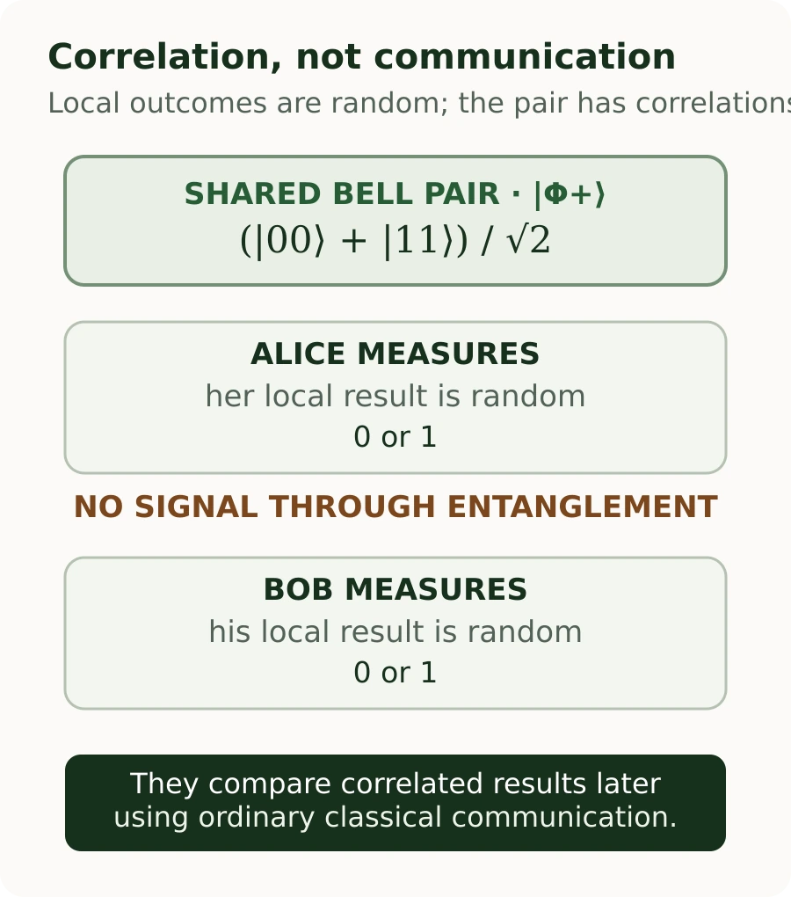

In [Part 1](/posts/classical-vs-quantum-logic-gates/), we saw that CNOT can turn a superposed input into a Bell state. [Part 2](/posts/qubits-superposition-phase-bloch-sphere/) gave us the tools to reason about amplitudes, relative phase, and measurement. This chapter asks what changes when quantum information can no longer be described one qubit at a time.

The useful starting point is not a story about distant particles sending messages. It is **separability**: can the state of a pair be written as one state for the first qubit multiplied by one state for the second? For some joint states, the answer is no. That is the mathematical feature called entanglement, and Bell states provide a compact way to see why it matters.

## From one qubit to a joint state

For a single qubit, we write a pure state as `|ψ⟩ = α|0⟩ + β|1⟩`. To describe two qubits, we need a state space that combines the possibilities for each subsystem. The notation `|0⟩ ⊗ |0⟩`, usually shortened to `|00⟩`, is called a **tensor product**. For our purposes, it means “the joint system with the first qubit in 0 and the second in 0.”

The two-qubit computational basis is `|00⟩`, `|01⟩`, `|10⟩`, and `|11⟩`. A general pure state of the pair is:

`|ψ⟩ = α|00⟩ + β|01⟩ + γ|10⟩ + δ|11⟩`

The four amplitudes describe the **joint system**, and normalization requires `|α|² + |β|² + |γ|² + |δ|² = 1`. As in Part 2, squared magnitudes give measurement probabilities in the computational basis. But four probabilities alone still do not tell the whole story: phases can affect later measurements.

IBM Quantum Learning describes a composite system by taking the tensor product of its component state spaces. This is a mathematical model for the pair as a whole, not a claim that the qubits need to be physically adjacent. [Its lesson on multiple systems](https://quantum.cloud.ibm.com/learning/en/courses/basics-of-quantum-information/multiple-systems/quantum-information) develops the construction.

## Product states and separability

Some joint states can be described independently. The simplest example is `|00⟩ = |0⟩ ⊗ |0⟩`. Each qubit has a definite pure state, and combining those two descriptions gives the joint state.

Now put the first qubit into the superposition `|+⟩ = (|0⟩ + |1⟩)/√2`, while leaving the second at `|0⟩`:

`|+⟩ ⊗ |0⟩ = (|00⟩ + |10⟩)/√2`

This is a superposition of two basis states, but it is **not entangled**. The first subsystem is still described by `|+⟩`; the second is still described by `|0⟩`. The joint description factors cleanly into the two individual states. Superposition does not automatically mean entanglement.

A pure two-qubit state is **separable** if there are single-qubit states `|ψA⟩` and `|ψB⟩` such that:

`|ψAB⟩ = |ψA⟩ ⊗ |ψB⟩`

If no such pair of single-qubit states can reproduce the joint amplitudes, the pure state is **entangled**. IBM’s formal introduction uses this non-factorization as the state-vector definition. For mixed states, separability has a broader definition: a state is separable when it can be written as a probabilistic mixture of product states. We will distinguish those cases when comparing a Bell pair with classically correlated bits. [IBM’s treatment of multiple systems and reduced states](https://quantum.cloud.ibm.com/learning/en/courses/general-formulation-of-quantum-information/density-matrices/multiple-systems) covers both.

For `|Φ+⟩`, the product-state expansion gives a short mathematical test: the amplitudes for `01` and `10` would have to be zero while those for `00` and `11` are nonzero. No choice of two single-qubit amplitudes can satisfy all four conditions at once. This is stronger than just noticing that two measurement results look linked; it tests whether the joint state itself factors.

## Build the Bell state

Start with two qubits in `|00⟩`. Apply Hadamard to the first qubit and identity to the second:

`(H ⊗ I)|00⟩ = (|00⟩ + |10⟩)/√2 = |+⟩ ⊗ |0⟩`

The state is now a superposition, yet it remains separable. Next apply CNOT, with the first qubit as control and the second as target. The gate maps `|00⟩ → |00⟩` and `|10⟩ → |11⟩`, so linearity gives:

`(|00⟩ + |10⟩)/√2 → (|00⟩ + |11⟩)/√2 = |Φ+⟩`

The result is the Bell state `|Φ+⟩`. There is no way to pick one pure state for qubit A and another pure state for qubit B whose tensor product gives exactly these four joint amplitudes. If we tried `|a⟩ = a₀|0⟩ + a₁|1⟩` and `|b⟩ = b₀|0⟩ + b₁|1⟩`, their product would have amplitudes `a₀b₀`, `a₀b₁`, `a₁b₀`, and `a₁b₁` for `00`, `01`, `10`, and `11`. To match `|Φ+⟩`, the middle two products must be zero while both `a₀b₀` and `a₁b₁` are nonzero. No choices satisfy all four conditions. The state belongs to the pair and cannot be reconstructed from independent pure subsystem states.

### CNOT does not entangle every input

CNOT is an entangling gate, meaning it **can** create entanglement for suitable inputs. It does not make every output entangled. For example, `CNOT|00⟩ = |00⟩`, which is still a product state. Likewise, `CNOT|10⟩ = |11⟩` is a product state. In the Bell-state circuit, CNOT acts on a superposition whose two components respond differently. The resulting amplitudes cannot be factored, so the output is entangled.

Hadamard alone does not entangle either. Applied to `|00⟩` on just the first wire, it produces `|+⟩ ⊗ |0⟩`. It is the combination of the input and the two-qubit operation that matters, not a magic property attached to one gate symbol.

## Four Bell states, with phase intact

There are four standard maximally entangled two-qubit Bell states:

```text
|Φ+⟩ = (|00⟩ + |11⟩) / √2
|Φ−⟩ = (|00⟩ − |11⟩) / √2
|Ψ+⟩ = (|01⟩ + |10⟩) / √2
|Ψ−⟩ = (|01⟩ − |10⟩) / √2
```

The Φ states produce equal bits in a Z-basis measurement: `00` or `11`. The Ψ states produce opposite bits: `01` or `10`. The `+` and `−` signs encode relative phase. For example, `|Φ+⟩` and `|Φ−⟩` have identical probabilities for all four outcomes in the computational basis: half for `00`, half for `11`, and zero for the other two. In the X basis, `|Φ+⟩` gives equal results while `|Φ−⟩` gives opposite results. Their phase difference becomes visible in another basis, just as `|+⟩` and `|−⟩` did in Part 2.

For `|Φ+⟩`, measuring both qubits in the Z basis yields `00` or `11`, each with probability one half. If Alice measures `0`, the conditional state for Bob’s qubit is `|0⟩`; if Alice measures `1`, Bob’s conditional state is `|1⟩`. This describes the conditional predictions for their records. Alice cannot choose which outcome she gets, and Bob’s local outcomes remain random when considered without Alice’s record.

## Correlation is not yet entanglement

Imagine a classical source that flips a fair coin and gives both Alice and Bob the resulting bit. They receive `00` half the time and `11` half the time. Their Z-basis records are perfectly correlated, just like `|Φ+⟩`. But the classical system can be described as a mixture: with 50% probability it is `|00⟩`, and with 50% probability it is `|11⟩`. Each trial has an ordinary shared random bit; the source does not need a coherent joint quantum state.

The same distinction appears in quantum notation. A classical mixture of the two product states is separable, even though it has correlations. A Bell state is a pure joint state that cannot be factored into independent pure states. Therefore, one table of matching results in one measurement basis does not prove entanglement. We need to ask how outcomes relate under different measurement settings.

In density-matrix notation, the classical source is `ρ = ½|00⟩⟨00| + ½|11⟩⟨11|`. Each run is in one of two product states, with our description averaging over which one the source selected. That differs from the pure-state density matrix `|Φ+⟩⟨Φ+|`, which also contains cross terms between `|00⟩` and `|11⟩`. Those terms encode coherence and help explain why a change of measurement basis reveals different correlations. You do not need to calculate density matrices to use the practical distinction: a randomized choice between product states is not the same state as a coherent superposition of them.

### Compare measurements in the X basis

The X-basis states are `|+⟩ = (|0⟩ + |1⟩)/√2` and `|−⟩ = (|0⟩ − |1⟩)/√2`. Rewriting the Bell state in that basis gives:

`|Φ+⟩ = (|++⟩ + |−−⟩)/√2`

So if both parties measure in X, their outcomes are also correlated: both obtain `+` or both obtain `−`. By contrast, for the classical mixture of `00` and `11`, an X-basis measurement of each individual bit is balanced and the pair’s results are uncorrelated: all four X outcome pairs occur with equal probability. The mixture and the Bell state agree on Z-basis statistics but disagree in X. The difference is not visible if we treat measurement probabilities in one basis as the entire description.

## Bell’s theorem and what experiments show

Changing bases exposes a deeper result. Bell’s theorem shows that certain patterns of quantum correlations cannot be reproduced by local hidden-variable models that satisfy the assumptions used to derive Bell inequalities. In the CHSH version, each observer can choose between two measurement settings and record outcomes as `+1` or `−1`. Assuming the settings are independent of the source’s hidden variables, a particular combination `S` of the four pairwise correlations must obey `|S| ≤ 2` for those local models. Quantum theory predicts values up to `2√2` for suitable states and settings. A Bell state does not violate CHSH under every arbitrary choice of measurements; the settings matter.

Experiments have observed violations of Bell inequalities. The 2022 Nobel Prize in Physics recognized experiments with entangled photons that established such violations and advanced quantum information science. These results rule out the relevant class of local hidden-variable explanations; they do not establish that every hidden-variable theory is impossible or settle every philosophical interpretation. [IBM’s CHSH lesson](https://quantum.cloud.ibm.com/learning/en/modules/quantum-mechanics/bells-inequality-with-qiskit) explains the measurement-setting experiment, while the [Nobel Prize summary](https://www.nobelprize.org/prizes/physics/2022/summary/) describes the recognized experimental work.

The comparison is statistical. One trial produces a single pair of outcomes and cannot establish a bound. The experiment is repeated for each setting pair, and averages estimate the correlations used to calculate `S`. Settings must be selected and the setup arranged so the assumptions behind the inequality are credible; real experiments also account for noise and detection limits. This is why a Bell test is a protocol over many trials, not a special outcome that appears whenever two qubits are entangled. The `2√2` value is the quantum maximum for the CHSH expression, not a prediction that every device or every measurement choice will reach it.

## Entanglement is not a faster-than-light channel

The Bell-state correlations do not let Alice send Bob a message. When Alice measures, her result is random. Bob’s local result is also random. Looking only at Bob’s outcomes, he cannot tell whether Alice measured, which basis she selected, or what result she got. To discover the correlation, they must later compare their records through an ordinary classical channel.

It is common to describe a measurement as changing the joint state or updating the conditional state assigned to the unmeasured qubit. That description helps calculate conditional outcomes, but it does not give Alice control over Bob’s local statistics. IBM’s reduced-state treatment makes this distinction explicit: Bob’s local state, when Alice is ignored, remains the maximally mixed state, consistent with the impossibility of faster-than-light communication. [Quantum teleportation](https://quantum.cloud.ibm.com/learning/en/courses/basics-of-quantum-information/entanglement-in-action/quantum-teleportation) is a useful example: it consumes shared entanglement but still requires two classical bits from Alice to Bob before the receiver can complete the protocol. It transfers quantum information, not matter, and does not bypass ordinary communication.

<figure class="article-figure">



<figcaption>Entanglement produces joint statistics that Alice and Bob can confirm after comparing records; it does not provide a controllable message channel.</figcaption>

</figure>

## One joint state, two mixed local states

Part 2 introduced the Bloch sphere as a representation for one pure qubit. Two independent pure qubits can be described with two such pure-state Bloch vectors, and their product specifies the pair. An entangled pair is different: two independent pure-state vectors cannot specify its complete joint state. The Bloch sphere is still useful for each subsystem’s **reduced state**, but a reduced state may be mixed and lies inside the Bloch sphere’s surface, in the Bloch ball.

For `|Φ+⟩`, the joint pair is in a pure state. If we ignore Bob and describe only Alice’s qubit, her reduced state is `ρA = I/2`; Bob’s is likewise `ρB = I/2`. Here `I` is the one-qubit identity matrix. In practical terms, either party alone sees a 50/50 result in every basis. Neither local description contains the pair’s correlations. The full information belongs to the joint state. IBM Quantum Learning derives these reduced states using the partial trace; we only need the result here.

This is another reason not to picture entanglement as two classical variables synchronized behind the scenes. There are no independently pure local states whose hidden values account for the entire pair. The quantum state encodes relationships that appear only in joint measurement statistics.

## Why entanglement matters

Entanglement is a resource in several quantum-information protocols. In **quantum teleportation**, a shared Bell pair plus classical communication lets a sender transfer an unknown qubit state to a receiver; the sender’s original state is consumed in the process. **Superdense coding** uses shared entanglement to change how much classical information can be conveyed by transmitting a qubit. Entanglement also appears in quantum error-correcting codes and in algorithms where joint states carry correlations that the computation later uses.

In error correction, for example, logical information is encoded across multiple physical qubits so certain errors can be detected and corrected without directly reading out the encoded state. Entanglement between data and auxiliary qubits is part of how syndrome information is extracted. This does not make every multi-qubit circuit useful: creating and preserving entanglement is difficult on noisy hardware, and the algorithm must still turn its state into a measurable answer.

Those examples do not mean that entanglement alone guarantees an advantage. A useful result depends on the task, the circuit, the available quantum hardware, and how measurement outcomes are processed. Entanglement is a capability in the model, not a universal speedup switch. IBM Quantum Learning’s [entanglement resource lessons](https://quantum.cloud.ibm.com/learning/en/courses/basics-of-quantum-information/entanglement-in-action/introduction) work through teleportation, superdense coding, and the CHSH game.

## A software engineer’s mental model

For independent pure subsystems, a compact conceptual model is `State<A> × State<B>`: each component has a complete pure-state description, and the pair is their product. For an entangled pair, think `JointState<A, B>`: the system has one joint description that cannot be rebuilt from two independent pure states.

That is only an analogy. Entanglement is not shared memory, object references, synchronized variables, or an event sent from one qubit to another. The practical lesson is about the shape of the state: sometimes the pair contains quantum information that no separate pure-state description of A and B can capture. Measurements expose pieces of that relationship, and comparing results requires ordinary communication.

## Where this series goes next

Part 1 introduced CNOT and the Bell-state preparation circuit. Part 2 explained the single-qubit amplitudes and phase that make the circuit’s output more than a pair of correlated classical bits. We have now used separability, measurement bases, and Bell tests to understand what the joint state adds.

The natural next question is how circuits use operations and interference to shape measurement outcomes for a computational task. That would lead into **quantum circuits and interference**, but no later chapter is needed to take away this distinction: a superposition concerns amplitudes within a state; entanglement concerns whether a joint state can be decomposed into independent subsystem states.

## References

- [IBM Quantum Learning: Quantum information and multiple systems](https://quantum.cloud.ibm.com/learning/en/courses/basics-of-quantum-information/multiple-systems/quantum-information)
- [IBM Quantum Learning: Multiple systems and reduced states](https://quantum.cloud.ibm.com/learning/en/courses/general-formulation-of-quantum-information/density-matrices/multiple-systems)
- [IBM Quantum Learning: Bell states and quantum mechanics basics](https://quantum.cloud.ibm.com/learning/en/courses/use-a-qc-today/quantum-mechanics-basics)
- [IBM Quantum Learning: Bell’s inequality with Qiskit](https://quantum.cloud.ibm.com/learning/en/modules/quantum-mechanics/bells-inequality-with-qiskit)
- [Clauser, Horne, Shimony, and Holt: Proposed Experiment to Test Local Hidden-Variable Theories](https://journals.aps.org/prl/abstract/10.1103/PhysRevLett.23.880)
- [IBM Quantum Learning: Entanglement as a resource](https://quantum.cloud.ibm.com/learning/en/courses/basics-of-quantum-information/entanglement-in-action/introduction)
- [IBM Quantum Learning: Quantum teleportation](https://quantum.cloud.ibm.com/learning/en/courses/basics-of-quantum-information/entanglement-in-action/quantum-teleportation)
- [The Nobel Prize in Physics 2022: Summary](https://www.nobelprize.org/prizes/physics/2022/summary/)
