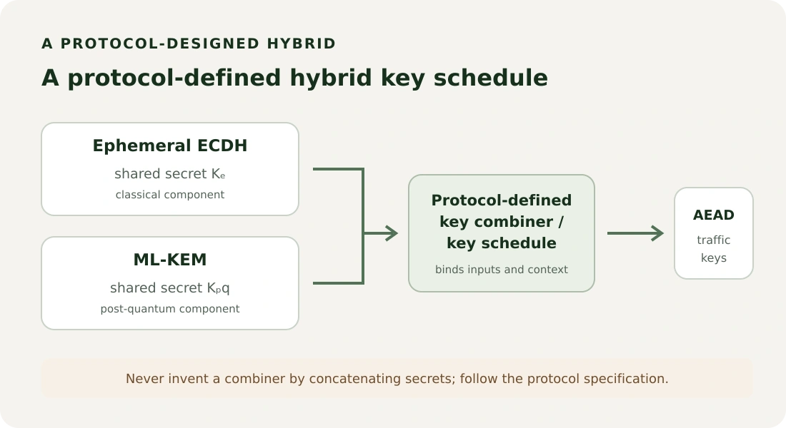

In [Part 1](/posts/post-quantum-cryptography-engineers/), we looked at why software teams are preparing for public-key algorithms designed to resist known quantum attacks. This article moves from the migration question to one standardized primitive: ML-KEM, the Module-Lattice-Based Key-Encapsulation Mechanism in NIST FIPS 203.

The most useful starting point is a correction to a familiar mental model. ML-KEM is not a post-quantum version of `publicKey.encrypt(file)`. It establishes shared secret keying material. A protocol uses that material, often through a key schedule, to protect application data with symmetric authenticated encryption.

## First: ML-KEM does not encrypt your application data

With a public-key encryption API, a caller might expect to give the public key a message and get back ciphertext that the private key can decrypt into that same message. **That is not the ML-KEM interface.** Its standardized operations produce an encapsulation key pair, a KEM ciphertext, and shared secret bytes.

The recipient makes an encapsulation key available to the sender and keeps the corresponding decapsulation key private. The sender runs encapsulation using the recipient’s key. That operation returns two things: a KEM ciphertext to send, and a shared secret to keep. The recipient uses its decapsulation key with the received KEM ciphertext to derive matching secret material.

The secret itself is never sent. And the KEM ciphertext is not the encrypted file, API message, or database record. It is the KEM’s protocol input to decapsulation. The distinction is visible in the diagram: only `c` crosses from sender to recipient; each side holds its own copy of the shared secret.

## What is a Key Encapsulation Mechanism?

NIST defines a KEM as a set of algorithms that can let two parties establish a shared secret over a public channel, under the scheme’s security conditions. The FIPS 203 names are `ML-KEM.KeyGen`, `ML-KEM.Encaps`, and `ML-KEM.Decaps`.

Using the standard’s key names, a simplified view is:

```text
(ek, dk) = ML-KEM.KeyGen()
(K, c)   = ML-KEM.Encaps(ek)
K'       = ML-KEM.Decaps(dk, c)
```

`ek` is the **encapsulation key**. It can be distributed. `dk` is the **decapsulation key** and must remain protected. `c` is the KEM ciphertext. `K` and `K'` are 32-byte shared secret keys. For a correctly generated key pair and a ciphertext produced by encapsulation, the two outputs match, with overwhelming probability.

FIPS 203 prefers the specific terms _encapsulation key_ and _decapsulation key_ over the more familiar “public key” and “private key.” The latter can help orient readers, but can also suggest that ML-KEM works like RSA encryption. The distinct terms remind us what each key actually does.

## Step 1: Generate the ML-KEM key pair

The recipient runs `ML-KEM.KeyGen()`. The algorithm generates its required randomness internally and returns an encapsulation key and a decapsulation key. In an application, the cryptographic provider should own this randomness generation; do not pass in timestamps, UUIDs, or an ordinary application PRNG as a substitute.

The recipient publishes or securely provisions `ek` and protects `dk` as secret key material. “Public” does not mean “trust any copy you receive”: the sender still needs assurance that the encapsulation key belongs to the intended recipient. Depending on the protocol, certificates, signatures, an authenticated channel, or another reviewed mechanism binds the key to an identity.

Key lifetime is also a protocol choice. A static recipient key may be used for many encapsulations; an ephemeral key pair may be restricted to one exchange and discarded. Those patterns have different operational and forward-secrecy properties. ML-KEM by itself does not decide which pattern an application needs.

## Step 2: Encapsulation

The sender checks that it has the intended recipient’s valid encapsulation key, then invokes `ML-KEM.Encaps(ek)`. The operation uses fresh cryptographic randomness and returns `(K, c)`: the sender’s shared secret and the KEM ciphertext.

Both outputs matter, but they have different destinations. The application keeps `K` as secret key material for the protocol. It sends `c` to the recipient. The recipient does not recover `K` by decrypting the KEM ciphertext into a transmitted copy of the key. Instead, decapsulation applies the corresponding secret key and KEM construction to derive the matching value.

## Step 3: Send the KEM ciphertext

The sender transmits `c`, along with whatever protocol fields are required to identify the algorithm, recipient key, session, and context. It does **not** transmit `K`.

That distinction also prevents a common naming mistake. The KEM ciphertext is a cryptographic output required by decapsulation; an application may wrap it in a protocol message or encrypted-data envelope. Calling both that value and the protected file “the ciphertext” without distinguishing them invites bugs in serialization and API design.

## Step 4: Decapsulation

The recipient calls `ML-KEM.Decaps(dk, c)`. It uses the secret decapsulation key and received KEM ciphertext to return `K'`, a 32-byte shared secret key. For an unmodified ciphertext from the matching encapsulation operation, `K'` matches the sender’s `K` with overwhelming probability.

The values are equal because the encapsulation algorithm constructs `c` and `K` together in a way that the corresponding decapsulation operation can reproduce. The protocol sends enough public material to enable this computation, but the secret output is not transmitted.

### What if the ciphertext was changed?

FIPS 203 includes **implicit rejection**. A ciphertext with an invalid type or required length fails the prescribed input check. For a correctly sized ciphertext whose contents fail the internal re-encryption check, decapsulation does not return an ordinary “invalid ciphertext” flag. It derives a pseudorandom fallback secret tied to the ciphertext and a secret value, and returns that 32-byte result. The sender’s original key and recipient’s fallback key will differ, so later authenticated processing or an explicit key-confirmation step fails.

This behavior avoids handing an attacker a simple validity signal from decapsulation. Input checks still matter: malformed encodings or a ciphertext with the wrong required length must be rejected as invalid input before the algorithm is run. A protocol must also handle a downstream authentication or key-confirmation failure safely, without turning it into a detailed oracle or continuing with unauthenticated data. Application code should use the provider’s documented error behavior and the enclosing protocol’s failure rules, not invent a second validity test for ML-KEM output.

## So where does AES-GCM enter?

ML-KEM establishes secret keying material; a key derivation function or protocol key schedule can process it with context to produce one or more symmetric traffic keys. An AEAD such as AES-GCM then encrypts and authenticates the application payload with the appropriate key, nonce, and associated data.

FIPS 203’s shared secret is always 256 bits. Under the standard’s conditions it can be used directly as symmetric key material; where an application needs derived keys or a protocol defines a key schedule, use the approved construction it specifies. The point is not “always add your own KDF.” It is “follow the protocol’s key-use rules rather than inventing a construction around raw bytes.”

For example, AES-256-GCM uses a 256-bit AES key, but secure use also requires correct nonce handling and authentication-tag verification. ML-KEM does not select or manage the AEAD nonce, bind application metadata as associated data, or define how a receiving service reacts to an authentication failure. Those are protocol and application responsibilities.

## A KEM is not ordinary public-key encryption

These models can be compared without implying that all public-key cryptography behaves the same way:

```text
Public-key encryption:
message → encrypt with public key → ciphertext → decrypt with private key → message

KEM:
recipient key → encapsulate → shared secret + KEM ciphertext
KEM ciphertext + recipient secret key → decapsulate → matching shared secret
shared secret → protocol key schedule → symmetric AEAD → application data
```

A KEM can be combined with a symmetric encryption scheme to build a public-key encryption construction; NIST calls this the KEM-DEM approach. In that larger construction, both the KEM ciphertext and the symmetric payload ciphertext are sent. FIPS 203 explicitly says its internal K-PKE component is not approved as a standalone public-key encryption scheme. Application code should call the standardized ML-KEM interface, not reach into those internal algorithms or assume the KEM alone encrypts arbitrary messages.

| Property                         | RSA-style encryption                                                                      | ECDH-style key agreement                                                                | ML-KEM                                                                                |
| -------------------------------- | ----------------------------------------------------------------------------------------- | --------------------------------------------------------------------------------------- | ------------------------------------------------------------------------------------- |
| Primary role                     | Can encrypt small data or transport key material; RSA also has signature uses             | Both parties contribute ephemeral key shares to derive shared key material              | An encapsulator derives a secret using the recipient’s encapsulation key              |
| Output                           | Encrypted message or transported key                                                      | Shared secret at both parties                                                           | Shared secret and KEM ciphertext                                                      |
| Does it encrypt a file directly? | RSA encryption is not suited to bulk files; schemes use symmetric encryption for payloads | No                                                                                      | No                                                                                    |
| Main post-quantum distinction    | RSA’s factoring assumption is vulnerable to Shor’s algorithm at sufficient quantum scale  | Conventional elliptic-curve discrete-log assumptions are vulnerable to Shor’s algorithm | Based on the presumed hardness of Module-LWE, designed for post-quantum security      |
| What else is needed?             | Scheme and protocol choices, key authentication, and usually symmetric encryption         | Authenticated key agreement, key schedule, and symmetric encryption                     | Authenticated key establishment, appropriate key processing, and symmetric encryption |

This table compares mental models, not every way these primitives can be composed. RSA has multiple standardized uses; ECDH key agreement and ML-KEM encapsulation have different message flows and security properties.

## If you know ECDH, this may feel more familiar

ECDH is a helpful comparison because engineers often encounter it as part of TLS: parties exchange public key shares and each computes the same secret using its own private ephemeral value. A key schedule then derives traffic keys. ML-KEM also aims to produce matching secret material for two parties, but the roles are asymmetric: the recipient has a key pair first, and the sender uses the recipient’s encapsulation key to create both the shared secret and the ciphertext that the recipient decapsulates.

So the useful analogy is `key establishment → shared secret → protocol key schedule`, not “ML-KEM is ECDH with different math.” Their key generation, messages, assumptions, and security properties differ. That is why protocol standards define exactly how a KEM is used rather than asking application teams to swap one primitive name in an ECDH API.

## Why not just use RSA?

Part 1 explains the broader quantum threat. Briefly, Shor’s algorithm would threaten the factoring and discrete-log assumptions underlying RSA and common ECC schemes if a sufficiently capable, fault-tolerant quantum computer became available. ML-KEM uses a different mathematical assumption and is designed to withstand known attacks from classical and quantum adversaries. That is a security goal supported by analysis, not a proof that the algorithm can never be broken.

ML-KEM is also not “quantum cryptography.” It runs on ordinary computers and does not require quantum hardware. The quantum-computing concepts in [Quantum Computing Fundamentals Part 2](/posts/qubits-superposition-phase-bloch-sphere/) provide separate background on amplitudes and phase; that article belongs to a different series and is not a prerequisite for using ML-KEM.

## What is under ML-KEM?

The security of ML-KEM is related to the presumed computational difficulty of **Module Learning With Errors (Module-LWE)**. At a high level, Learning With Errors uses linear relationships that have been obscured by carefully sampled small errors. A simplified toy picture might expose values resembling `A` and `A·s + e`, where `s` is secret and `e` is small noise. Recovering `s` from enough noisy equations is believed to be computationally hard at the chosen parameters.

ML-KEM uses polynomial arithmetic organized into modules over a lattice-related structure. The module structure gives a compact, efficient construction; the security analysis relates its average-case instances to hard lattice problems. The toy expression is only intuition, not the exact standardized algorithm or a recipe for implementing it. FIPS 203 defines the actual sampling, encoding, compression, hashing, checks, and transformations.

The noise here is deliberate mathematical structure generated within the construction. It is not network corruption that the recipient tries to guess through, and it is not an accidental implementation error. Encapsulation and decapsulation are designed to recover matching key material for valid exchanges despite this construction; modifications to the transmitted ciphertext are handled by the standardized implicit-rejection behavior described above.

### Kyber and ML-KEM are related, not interchangeable labels

FIPS 203 says ML-KEM is derived from the round-three CRYSTALS-Kyber submission and documents differences that affect input/output behavior. The standardized algorithm has the fixed 256-bit shared secret, explicit input checks, and other final-specification details. An older API, test vector, wire format, or product labelled “Kyber” might implement a pre-standard version. Check that an implementation explicitly conforms to final NIST FIPS 203 and can interoperate with the intended peer; do not infer compatibility from the name alone.

## ML-KEM parameter sets

FIPS 203 specifies three parameter sets. Their suffixes are identifiers, **not key sizes in bits** and not the bit strength of a shared secret. The sets configure parameters such as the module dimension `k` (2, 3, or 4), noise sampling, and ciphertext compression. NIST associates them with security categories 1, 3, and 5 respectively. A category is a comparison class against specified generic attacks, not a promise of an exact number of classical or quantum “security bits.”

| Parameter set | NIST security category | Encapsulation key | Decapsulation key | KEM ciphertext | Shared secret |
| ------------- | :--------------------: | ----------------: | ----------------: | -------------: | ------------: |
| ML-KEM-512    |           1            |         800 bytes |       1,632 bytes |      768 bytes |      32 bytes |
| ML-KEM-768    |           3            |       1,184 bytes |       2,400 bytes |    1,088 bytes |      32 bytes |
| ML-KEM-1024   |           5            |       1,568 bytes |       3,168 bytes |    1,568 bytes |      32 bytes |

These are the serialized FIPS 203 sizes, not the size of a complete protocol message, certificate, or encrypted envelope. ML-KEM-768 is a useful concrete example because it is the middle of the three standardized parameter sets and is used in current TLS hybrid groups. That does not make it a universal recommendation. Select a parameter set according to protocol requirements, security guidance, interoperability, and performance constraints.

The larger key and ciphertext sizes have practical effects. ML-KEM-768’s encapsulation key is 1,184 bytes and its ciphertext is 1,088 bytes, compared with a 32-byte X25519 public share. A protocol can carry this overhead, but engineers should account for it in framing, request limits, serialization, buffers, packetization, certificate or key-container formats, and stored envelopes. Measure the whole handshake or message path; do not assume it will fail simply because one field is larger.

NIST’s FIPS 203 page currently records final publication on August 13, 2024 and includes a planning note that a correction will appear in a future revision, with a linked errata file. The values above are from the published standard’s parameter table; check NIST’s current FIPS page and errata before making an implementation or compliance decision.

## Why migration may use hybrid key establishment

During a transition, a protocol may combine a classical exchange such as ECDH with ML-KEM. A properly specified hybrid design feeds both results into a protocol-defined combiner or key schedule. The intent is to avoid relying exclusively on either component, under the combiner’s assumptions and the protocol’s security analysis. Concatenating two byte strings and hashing them yourself is not a generally safe hybrid construction.

This is already more than a theoretical API sketch: [RFC 10024](https://www.rfc-editor.org/rfc/rfc10024.html) defines hybrid key agreement groups for TLS 1.3 that combine ML-KEM with ephemeral elliptic-curve Diffie–Hellman. [RFC 9954](https://www.rfc-editor.org/rfc/rfc9954.html) specifies the framework for combining key shares. These documents define the wire encoding and key schedule behavior; they do not imply that every TLS deployment or library already enables those groups.

<figure class="article-figure">



<figcaption>A hybrid protocol combines both key-establishment results according to a reviewed specification. The combiner and transcript/context handling are part of the protocol, not application glue code.</figcaption>

</figure>

This matters for data that must remain confidential for years. An attacker could record encrypted traffic now and try to decrypt it later if future capabilities compromise the classical key establishment. Part 1 discusses that risk model; a hybrid exchange is one migration approach, with compatibility and protocol costs that need to be evaluated.

## What ML-KEM does not provide

A KEM does not by itself authenticate the recipient, prove the sender’s identity, authorize a request, encrypt the application payload, or define replay protection. An attacker who substitutes an unauthenticated encapsulation key may establish a secret with the wrong party. A protocol needs an authenticated binding between keys, identities, negotiation, and transcript, as appropriate to its threat model.

ML-KEM is also not a signature algorithm. NIST’s [ML-DSA](https://csrc.nist.gov/pubs/fips/204/final), specified in FIPS 204, is a separate module-lattice digital signature standard. Signatures support authenticity and integrity workflows; ML-KEM establishes shared key material. Choosing a KEM does not remove the need to authenticate peers or verify certificates.

## A software-engineering implementation model

The following is conceptual pseudocode, not a Java API or a complete protocol:

```text
Recipient:
    (encapsulationKey, decapsulationKey) = ML-KEM.KeyGen()
    publish encapsulationKey through an authenticated mechanism

Sender:
    (kemSecretSender, kemCiphertext) = ML-KEM.Encaps(encapsulationKey)
    send kemCiphertext

Recipient:
    kemSecretRecipient = ML-KEM.Decaps(decapsulationKey, kemCiphertext)

Both sides:
    sessionKeys = protocolKeySchedule(kemSecret, transcript, context)
    protect records with the protocol's authenticated-encryption scheme
```

In Java, use a maintained provider or cryptographic library whose documentation names final FIPS 203 ML-KEM support. API shape, provider selection, key serialization, and FIPS validation are implementation-specific; do not copy a sample from an older “Kyber” release and assume it is interoperable. Let the provider use its cryptographic random-number generator. Keep decapsulation keys and shared secrets out of logs, exception messages, telemetry, and long-lived application objects.

Managed runtimes add practical limits to secret cleanup. An application may drop references promptly, but garbage collection, immutable key wrappers, and internal copies mean that filling one byte array with zeros does not prove every copy was erased. Prefer provider-managed or hardware-backed key storage where suitable, minimize secret lifetime, and understand the guarantees the provider actually offers.

Implementation security also includes timing and other side channels, input validation, dependency updates, and safe error handling. A mathematically conforming algorithm is not automatically a secure deployment. Do not implement the lattice mathematics yourself for production, and do not convert a KEM into a custom protocol simply because its three operations look small.

## Crypto agility is part of the migration

The application should treat key establishment, key processing, authenticated encryption, key identifiers, and data-format versions as related but distinct protocol choices. A versioned envelope might identify an ML-KEM parameter set, KEM ciphertext, AEAD, nonce, and payload ciphertext. That is only an architecture sketch: a real format must specify canonical encoding, bounds, identity and context binding, authentication, nonce rules, and safe behavior for unsupported versions. Do not copy an illustrative JSON object into production and call it a protocol.

Put algorithm identifiers and version handling at a reviewed cryptographic boundary rather than scattering `if algorithm == ...` branches through business logic. Test old/new peer combinations, payload limits, downgrade behavior, failures, and rollback before rollout. Crypto agility is not arbitrary runtime algorithm selection; it is a planned way to evolve interoperable formats and protocols safely.

## The useful mental model

Do not think:

```text
ML-KEM = post-quantum RSA encrypt(file)
```

Think:

```text
ML-KEM → establish shared secret material
protocol key schedule / approved KDF → derive or process keys with context
AEAD → encrypt and authenticate application data
protocol → bind identities, negotiation, transcript, and failure behavior
```

That model applies even if a framework or TLS library performs the KEM steps below your application. Developers may encounter ML-KEM through TLS, messaging, VPNs, key-management systems, or a provider API, but support and defaults differ. Check the actual protocol and library behavior instead of inferring deployment from an algorithm’s standardization.

## Where this series goes next

Part 1 introduced the migration problem; Part 2 explained the KEM operation underneath one important post-quantum key-establishment standard. A useful next topic is how protocols combine classical and post-quantum secrets during migration. Other future directions include ML-DSA signatures, TLS deployment, key and certificate inventory, Java provider integration, and testing operational compatibility. The shared principle is to follow a reviewed standard at the protocol boundary and keep the surrounding software ready to evolve.

### Further reading

- [NIST FIPS 203: Module-Lattice-Based Key-Encapsulation Mechanism](https://csrc.nist.gov/pubs/fips/203/final)
- [NIST SP 800-227: Recommendations for Key-Encapsulation Mechanisms](https://csrc.nist.gov/pubs/sp/800/227/final)
- [RFC 10024: Post-Quantum Traditional Hybrid Key Agreement Mechanisms for TLS 1.3](https://www.rfc-editor.org/rfc/rfc10024.html)
- [RFC 9954: Hybrid Key Exchange in TLS 1.3](https://www.rfc-editor.org/rfc/rfc9954.html)
- [NIST FIPS 204: Module-Lattice-Based Digital Signature Standard](https://csrc.nist.gov/pubs/fips/204/final)
