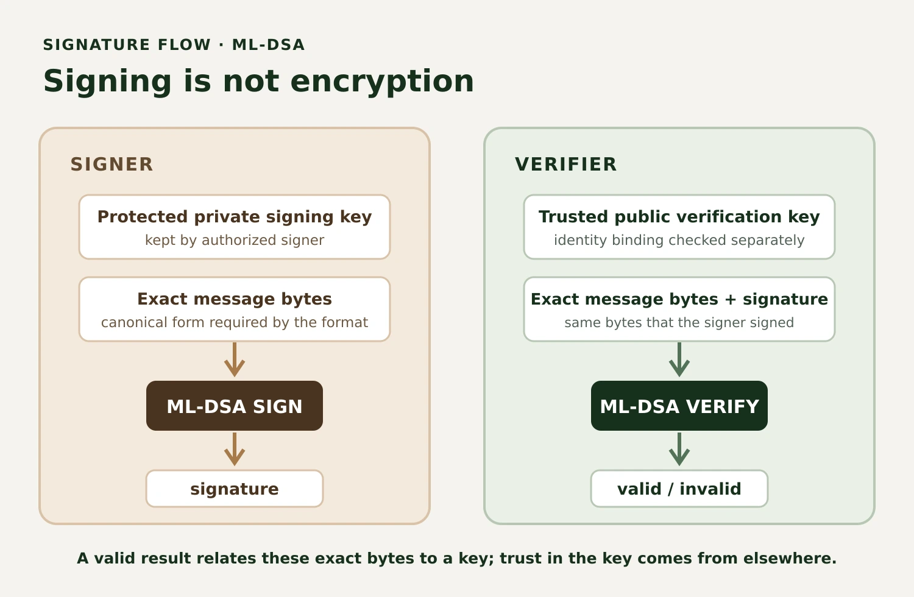

If ML-KEM helps establish shared secrets, how do we prove who signed a message?

That is the job of a digital signature. A sender signs data with a private key; a verifier checks the signature with the corresponding public key. NIST's [FIPS 204](https://csrc.nist.gov/pubs/fips/204/final) standardizes ML-DSA, a post-quantum digital signature scheme. It is a companion to the key-establishment story in [Part 2, Inside ML-KEM](/posts/inside-ml-kem/), and a new subject for the migration architecture from [Part 3, Crypto Agility](/posts/crypto-agility-java-post-quantum-migration/).

Part 1 explained why teams are preparing for post-quantum cryptography. This article focuses on a different question: what does a post-quantum signature do, how does ML-DSA fit Java applications, and what changes when signatures become much larger than the ones systems commonly use today?

## Encryption is not authentication

Encryption protects confidentiality: it helps keep message contents from parties who should not read them. A digital signature serves different purposes. It lets a verifier detect whether signed bytes changed and check that those bytes were signed by the holder of the private key corresponding to a particular public key.

That last phrase matters. A successful verification says something about the relationship between data and a key. It does not, by itself, tell you who controls that key. Your application needs a trusted way to obtain the correct public key and bind it to an account, organization, device, certificate, or other identity. If an attacker can replace a trusted key with their own, signatures they create can verify perfectly.

Signatures also do not encrypt a message. Anyone with the message and public key can verify it. Nor do signatures automatically prevent replay: a valid signed request can be captured and submitted again unless the protocol includes protections such as a nonce, expiry, sequence number, or unique transaction identifier and checks it appropriately.

AES-GCM is different again. It is authenticated symmetric encryption: parties holding the same secret key can encrypt and authenticate data, and the receiver can detect tampering. It does not provide the public verification property of a digital signature because verifiers share the secret. ML-KEM establishes shared keying material, ML-DSA signs and verifies, and AES-GCM protects data with a shared key.

## How digital signatures work

A signature system has key generation, signing, and verification operations. The signer protects a private key, computes a signature over particular bytes, and sends the message plus the signature. A verifier uses the associated public key to check the signature against those same bytes.

```text
Signer                                      Verifier
private key + message bytes                 trusted public key
            |                               + message bytes + signature
            v                                             |
          SIGN                                            v
            |                                           VERIFY
            v                                             |
         signature                                  valid / invalid
```

<figure class="article-figure">



  <figcaption>Signing produces a signature over bytes; verification checks those bytes against a key. It does not encrypt the message or establish the key owner's real-world identity.</figcaption>

</figure>

If even one signed byte changes, verification should fail. So should verification with an unrelated key. Verification failure means the application must not treat the data as authenticated: reject it or handle it through an explicit, safe error path. Do not continue as though a failed signature were merely a warning.

The exact byte sequence is part of the contract. JSON objects, for example, can have different whitespace, member order, Unicode encoding, and escaping while representing similar application values. The sender and verifier must sign and verify the same canonical representation defined by their protocol. Do not parse a message, serialize it differently, and assume the original signature will still validate.

A valid signature supports integrity and key-based authenticity. Real-world identity, authorization, trusted time, and legal meaning depend on additional systems and policy. A compromised private key can generate signatures that verify; a signature alone generally cannot tell whether a key was stolen or who operated it at signing time. Certificate validation, revocation or status checks, audit records, timestamps, and key custody processes provide context that the signature primitive does not.

## Why RSA and ECDSA face a quantum threat

RSA and common elliptic-curve signature systems rely on mathematical problems for which Shor's algorithm gives a sufficiently capable, fault-tolerant quantum computer a major speedup. That does not mean current quantum computers can break deployed RSA or ECDSA keys. It means organizations with long-lived trust anchors, software, firmware, or archived signatures should plan around the possibility that assumptions can change during the lifetime of those systems. [Part 1](/posts/post-quantum-cryptography-engineers/) covers that migration motivation in more detail.

ML-DSA uses a different mathematical foundation: module-lattice problems. It is a classical algorithm run by ordinary computers, designed to resist known classical and quantum attacks under its security assumptions. “Post-quantum” describes the intended resistance model; it does not mean unbreakable or mathematically proven secure forever.

## Introducing ML-DSA

ML-DSA stands for Module-Lattice-Based Digital Signature Algorithm. NIST published it as the final FIPS 204 standard on August 13, 2024. The standard defines three parameter sets: ML-DSA-44, ML-DSA-65, and ML-DSA-87. Their corresponding NIST security categories are 2, 3, and 5.

At a high level, ML-DSA's signing operation uses the private key and message to produce a fixed-format signature. Verification uses the public key, message, and signature to check the relationship. The scheme is built around structured lattice computations and a challenge-response style construction with rejection steps that keep the signature distribution within the design's security requirements. That gives a useful conceptual orientation, not enough detail to implement the scheme. Use a maintained, conforming cryptographic provider; do not implement the lattice arithmetic yourself.

FIPS 204 specifies the pure ML-DSA interface as the general-purpose form and also specifies pre-hash variants called HashML-DSA. A pre-hash variant signs a digest-based construction with a defined hash and context; it is not interchangeable with pure ML-DSA by simply hashing the message yourself first. Protocols need an unambiguous algorithm identifier and matching rules at both ends. For example, [RFC 9964](https://www.rfc-editor.org/rfc/rfc9964.html), published in 2026, defines ML-DSA representations for JOSE and COSE and intentionally specifies pure ML-DSA identifiers rather than HashML-DSA. Follow the format's algorithm definition instead of inventing your own pre-hash convention.

FIPS 204 also documents minor potential updates in a July 2026 planning note on the [NIST publication page](https://csrc.nist.gov/pubs/fips/204/final). The byte counts below are from the final standard's parameter table and are corroborated by [RFC 9881](https://www.rfc-editor.org/rfc/rfc9881.html). Consult NIST's current errata when selecting an implementation or making a compliance decision.

## ML-DSA-44, ML-DSA-65, and ML-DSA-87

The suffixes are parameter-set names, not key sizes in bits. In particular, `ML-DSA-65` does not mean a 65-bit key. FIPS 204 associates the sets with different internal parameters and security categories. A larger set has larger key and signature encodings, with corresponding resource and transport costs. These sizes do not predict performance; measure the actual provider, runtime, hardware, and workload you plan to deploy.

| Parameter set | NIST security category |  Public key | Private key seed | Expanded private key |   Signature |
| ------------- | ---------------------: | ----------: | ---------------: | -------------------: | ----------: |
| ML-DSA-44     |                      2 | 1,312 bytes |         32 bytes |          2,560 bytes | 2,420 bytes |
| ML-DSA-65     |                      3 | 1,952 bytes |         32 bytes |          4,032 bytes | 3,309 bytes |
| ML-DSA-87     |                      5 | 2,592 bytes |         32 bytes |          4,896 bytes | 4,627 bytes |

The 32-byte private-key seed is a compact representation from which the expanded key pair is derived. It is not the expanded private-key byte string. A format may store a seed, an expanded key, or both as specified by its encoding; ASN.1 wrappers add further bytes. For example, [RFC 9881's X.509 conventions](https://www.rfc-editor.org/rfc/rfc9881.html) describe these private-key choices, while [RFC 9964's JOSE/COSE conventions](https://www.rfc-editor.org/rfc/rfc9964.html) use the seed representation for private keys. Always compare like with like: raw FIPS sizes, provider `getEncoded()` sizes, and a complete certificate or JWK are not the same measurement.

Even the smallest standardized signature is a few kilobytes. That affects firmware manifests, package metadata, JWTs, API limits, database columns, signed events, certificate chains, and bandwidth. JOSE's base64url encoding adds representation overhead on top of the raw signature size. This is manageable in many systems, but it is a compatibility change: check proxy limits, message brokers, database fields, client libraries, storage, and latency budgets instead of assuming traditional ECDSA-sized signatures.

Security categories are comparison levels tied to reference security strengths, not exact statements that a parameter set has a particular number of “quantum bits.” Parameter choice belongs to a protocol and deployment policy. Do not infer that 87 is automatically the right option because its number is largest, or that 44 is equivalent to an RSA key with 44 bits.

## ML-KEM and ML-DSA solve different problems

Both are NIST-standardized module-lattice-based algorithms, but they are not substitutes for one another. [FIPS 203](https://csrc.nist.gov/pubs/fips/203/final) defines ML-KEM for key encapsulation; FIPS 204 defines ML-DSA for digital signatures.

| Property                                              | ML-KEM                                  | ML-DSA                                           | AES-GCM                                         |
| ----------------------------------------------------- | --------------------------------------- | ------------------------------------------------ | ----------------------------------------------- |
| Primary purpose                                       | Establish shared secret keying material | Sign data and verify signatures                  | Encrypt and authenticate data with a shared key |
| Secret/private material used                          | Decapsulation key                       | Signing private key                              | Shared symmetric key                            |
| Public or peer material                               | Encapsulation key                       | Verification public key                          | No public key; both parties hold the secret     |
| Output / check                                        | KEM ciphertext and shared secret        | Signature; verification returns valid or invalid | Ciphertext and authentication tag               |
| Does it encrypt arbitrary application data by itself? | No                                      | No                                               | Yes, within its input and nonce rules           |

ML-KEM is about producing shared secret material that a protocol can use in a key schedule. ML-DSA is about producing a signature over data. AES-GCM uses a symmetric key to protect an actual payload. A system might use all of them for different parts of a protocol, but the protocol must define how they fit together.

The nearby [SLH-DSA standard, FIPS 205](https://csrc.nist.gov/pubs/fips/205/final), provides a distinct stateless hash-based post-quantum signature family. It is an alternative with different size and performance trade-offs. The availability of multiple standards supports algorithm diversity, but does not make their key or signature formats interchangeable.

## Signing and verifying in Java

Java's JCA separates standard APIs such as `KeyPairGenerator` and `Signature` from the providers that implement them. The availability of a class or API does not guarantee a particular algorithm exists. Oracle's provider documentation lists ML-DSA in its SUN provider beginning with JDK 24; for example, Oracle's [JDK 24 provider list](https://docs.oracle.com/en/java/javase/24/security/oracle-providers.html) documents the `ML-DSA` key-pair generator and `ML-DSA`, `ML-DSA-44`, `ML-DSA-65`, and `ML-DSA-87` signature services. Other JDK distributions and provider configurations can differ. Java 21 does not have Oracle's built-in SUN-provider ML-DSA support.

This runnable JCA example was compiled and executed with Java 21 and Bouncy Castle Java 1.86. It uses the JCA provider rather than the lightweight ML-DSA API. Add the provider dependency `org.bouncycastle:bcprov-jdk18on:1.86`, register BC, and use a compatible release from the provider's official distribution. The example pins the provider explicitly so the selected implementation is clear; production provider selection should follow deployment, compliance, and key-management requirements.

```java
import java.nio.charset.StandardCharsets;
import java.security.KeyPair;
import java.security.KeyPairGenerator;
import java.security.Provider;
import java.security.SecureRandom;
import java.security.Security;
import java.security.Signature;
import java.security.spec.NamedParameterSpec;

import org.bouncycastle.jce.provider.BouncyCastleProvider;

public class MLDsaExample {
    public static void main(String[] args) throws Exception {
        Provider bc = new BouncyCastleProvider();
        Security.addProvider(bc);

        KeyPairGenerator generator = KeyPairGenerator.getInstance("ML-DSA", "BC");
        generator.initialize(new NamedParameterSpec("ML-DSA-65"), new SecureRandom());
        KeyPair signerKeys = generator.generateKeyPair();
        KeyPair otherKeys = generator.generateKeyPair();

        byte[] message = "release: 4.2.0".getBytes(StandardCharsets.UTF_8);
        Signature signer = Signature.getInstance("ML-DSA", "BC");
        signer.initSign(signerKeys.getPrivate(), new SecureRandom());
        signer.update(message);
        byte[] signature = signer.sign();

        Signature verifier = Signature.getInstance("ML-DSA", "BC");
        verifier.initVerify(signerKeys.getPublic());
        verifier.update(message);
        if (!verifier.verify(signature)) {
            throw new SecurityException("Signature did not verify");
        }

        byte[] modified = message.clone();
        modified[0] ^= 1;
        verifier.initVerify(signerKeys.getPublic());
        verifier.update(modified);
        if (verifier.verify(signature)) {
            throw new SecurityException("Modified message was accepted");
        }

        verifier.initVerify(otherKeys.getPublic());
        verifier.update(message);
        if (verifier.verify(signature)) {
            throw new SecurityException("Signature verified with the wrong key");
        }

        System.out.printf("Valid signature accepted; tampered message and wrong key rejected (%d-byte signature).%n",
                signature.length);
    }
}
```

The calls are standard JCA interfaces; `BouncyCastleProvider`, the named parameter string, and algorithm service implementations are provider-specific. For Oracle JDK 24+, its SUN provider documents built-in `ML-DSA` services and `NamedParameterSpec.ML_DSA_65`; select and test the exact provider available in your deployment. The example's chosen API names were tested on BC 1.86, Java 21. It generated a 3,309-byte ML-DSA-65 signature, accepted the original message, and rejected both a one-byte mutation and verification with a separately generated public key.

The sample keeps keys in memory to demonstrate the signature operation, not key storage. `getEncoded()` formats, import/export support, PKCS#8 and X.509 wrapping, HSM integration, and whether private keys can be exported are provider-specific deployment details. The raw parameter-table sizes do not include those wrappers. Verify interoperability by exchanging keys and signatures through the exact encoding and protocol your counterpart uses. The relevant standards include [RFC 9881 for X.509](https://www.rfc-editor.org/rfc/rfc9881.html) and [RFC 9964 for JOSE/COSE](https://www.rfc-editor.org/rfc/rfc9964.html); a provider's support for ML-DSA does not imply it supports every certificate, JWT, HSM, or remote-signing workflow.

## Signatures are part of software supply-chain trust

Digital signatures are already used to establish trust in software packages, firmware, container images, update manifests, documents, and API tokens. Replacing the signature algorithm can affect every producer and verifier in that chain: build systems, artifact repositories, deployment agents, clients, operating systems, certificate authorities, and long-term archives.

A signature format needs an algorithm identifier, public-key identity or key ID, an encoding, and defined rules about what bytes are signed. The verifier must obtain that public key through a trusted channel and enforce the expected algorithm and key type. Do not let an untrusted token header or file field silently choose an algorithm, or accept a weaker alternative after verification fails. Allowlist supported algorithms at the boundary and reject unsupported or disallowed choices.

Key IDs help select among managed keys; they are not proof that a key is trusted. Trust comes from a validated certificate path, a securely provisioned trust anchor, an authenticated directory, a pinned key, or another reviewed identity mechanism. Rotation needs an overlap plan so new signatures use the replacement key while verifiers can still validate legitimate artifacts signed with the previous key. Define expiry, revocation, compromise response, and the retention of verification keys before changing production signing systems.

For exact signed bytes, use a format that defines canonicalization. JOSE and COSE specify signature structures; their payload bytes and algorithm identifiers must follow the standard profile in use. A signature over a JSON string assembled differently by two implementations will not magically verify just because both intend the same object. Test real cross-implementation vectors and wire encodings.

## Migrating existing signature systems

Migration starts with an inventory: where are signatures generated, where are they checked, what exactly do they cover, which keys establish trust, and how long must old artifacts remain verifiable? Include code signing, TLS and certificates, JWT/JWS, firmware, package managers, mobile clients, hardware keys, build pipelines, third-party services, and offline archives. This is the signature side of the crypto-agility practices from [Part 3](/posts/crypto-agility-java-post-quantum-migration/).

Then make the compatibility boundary explicit. A versioned artifact or token should identify an approved signature suite and key ID according to a reviewed format. A staged rollout may deploy verifiers that recognize both old and new signatures before signers begin producing the new form. Observe which legacy signatures still appear, migrate or re-sign records when the format and trust model permit, then disable legacy signing and eventually remove verification support when policy and retention requirements allow.

Do not turn “support both” into “accept whatever the message requests.” A downgrade-resistant migration has a policy for each context: which algorithms can be used to create new signatures, which legacy algorithms may be accepted for historical material, and when the legacy path is disabled. The choice should be authenticated or bound by the relevant protocol. If the new signature is unavailable, reject or use a separately specified migration path; do not silently sign with an older key because a provider raised an exception.

Hybrid or composite signatures may help with transition in contexts that specify them, but composition and encoding must be standardized and interoperable. Do not concatenate independent signatures or invent a homemade combiner and call the result hybrid. Check that every producer, verifier, certificate profile, HSM, artifact system, and client understands the exact construction. RFC 9964 defines ML-DSA within JOSE and COSE, while [RFC 9881](https://www.rfc-editor.org/rfc/rfc9881.html) covers X.509 identifiers; those standards do not guarantee that a deployed product has implemented them.

## Operational and security considerations

**Protect the signing key.** Restrict access, use an appropriate keystore or managed signing service, control who can request signatures, and audit key use. Verify HSM/KMS algorithm support, key import/export formats, throughput, backup, disaster recovery, and attestation claims directly with the selected provider. Do not assume a device supporting RSA or ECDSA supports ML-DSA because it exposes a generic signing API.

**Verify the key before verifying the signature.** The key must be trusted for the expected signer and purpose. Validate certificates, key usage, trust anchors, revocation/status, and validity periods as required by the protocol. A valid signature from an unknown or unauthorized key is not authorization.

**Bind the correct context.** Sign the canonical message plus the protocol-defined context, purpose, version, or transaction data. A signature does not automatically stop replay; applications should include and enforce freshness or uniqueness when needed. A valid signature on an old payment request remains valid cryptographically.

**Treat failure as failure.** Invalid signatures, malformed encodings, unsupported algorithm identifiers, missing keys, and provider errors must not fall through to “accept anyway.” Keep error behavior useful for operations while avoiding detailed external responses that disclose sensitive verification behavior. Distinguish verification failure from provider outage in internal telemetry without logging private material or sensitive payloads.

**Keep formats strict.** Enforce size limits before allocating memory for multi-kilobyte signatures or untrusted key encodings. Reject malformed and non-canonical structures according to the format. Never deserialize a private key using unsafe Java object serialization. Prefer standard encodings and provider-supported key factories, and document exactly which representations peers exchange.

**Test durability and interoperability.** Keep test vectors from FIPS 204 and the authoritative protocol profile where available. Test valid signatures, altered messages, wrong keys, truncated and oversized signatures, unsupported parameters, key rotation, restart and key import, old artifact verification, and provider unavailability. A same-process “sign then immediately verify” test is necessary but insufficient: it cannot show that a second provider, a deployed verifier, or a years-old artifact uses the same encoding and canonical bytes.

## Preparing for post-quantum digital trust

ML-DSA is not a quantum-resistant encryption algorithm and does not replace ML-KEM or AES-GCM. It is a standardized way to sign and verify data using keys and signatures intended to withstand known quantum attacks under the scheme's assumptions. Its larger signatures and new key formats require engineering work across producers, verifiers, trust infrastructure, and archived artifacts.

The practical sequence is straightforward: inventory what you sign, establish how public keys become trusted, identify the exact bytes and formats, confirm provider and protocol support, test interoperability, roll out compatible verifiers, move signing under explicit policy, observe legacy use, and retire old paths deliberately. Continue the series with the [PQC migration overview in Part 1](/posts/post-quantum-cryptography-engineers/), the [ML-KEM mechanics in Part 2](/posts/inside-ml-kem/), and [Java crypto agility in Part 3](/posts/crypto-agility-java-post-quantum-migration/).

## References

- [NIST FIPS 204: Module-Lattice-Based Digital Signature Standard](https://csrc.nist.gov/pubs/fips/204/final)
- [NIST FIPS 203: Module-Lattice-Based Key-Encapsulation Mechanism Standard](https://csrc.nist.gov/pubs/fips/203/final)
- [NIST FIPS 205: Stateless Hash-Based Digital Signature Standard](https://csrc.nist.gov/pubs/fips/205/final)
- [RFC 9881: ML-DSA in Internet X.509 PKI](https://www.rfc-editor.org/rfc/rfc9881.html)
- [RFC 9964: ML-DSA for JOSE and COSE](https://www.rfc-editor.org/rfc/rfc9964.html)
- [Oracle JDK 24 provider documentation](https://docs.oracle.com/en/java/javase/24/security/oracle-providers.html)
- [Bouncy Castle Java 1.86 release and provider information](https://www.bouncycastle.org/resources/new-release-bouncy-castle-java-1-86/)
