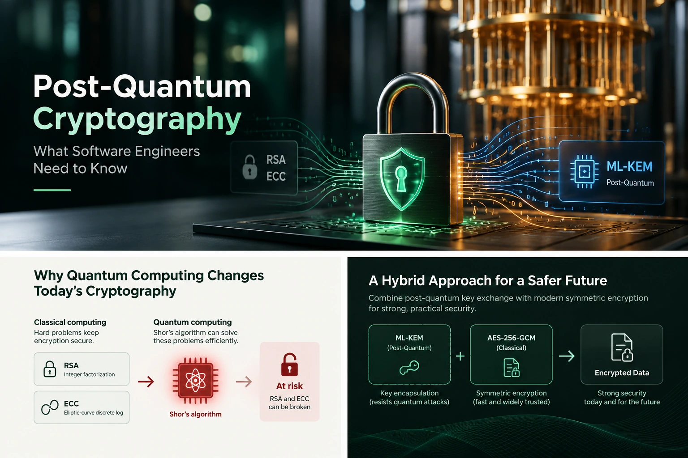

Post-quantum cryptography can sound like a distant research problem. For software teams, it is better understood as a long-lived systems migration: identify where public-key cryptography is used, understand which data must remain confidential, and make room for standards that are arriving in deployable form.

That work does not require predicting when a quantum computer will break today's public-key systems. No publicly known machine can currently do that at useful cryptographic scale, and assigning a calendar date to that capability would be speculation. The practical question is whether software and data outlive the algorithms protecting them.

## Why software engineers should care

Cryptography is usually several layers below the feature a team is building. A product may call TLS, a Java security provider, a cloud KMS, or a vendor SDK without naming the public-key algorithm involved. Yet the choice affects handshakes, certificates, encrypted files, stored keys, protocol compatibility, and what a future migration will cost.

There is also a confidentiality concern often called “harvest now, decrypt later.” An attacker could record encrypted traffic today and retain it in case future capabilities make some of that ciphertext readable. This is a risk model, not evidence that recorded data can already be decrypted. It matters most for information whose confidentiality must last many years, and it should be considered alongside more immediate risks such as endpoint compromise, weak key handling, and implementation flaws.

## The cryptography we rely on today

Two broad families do different jobs.

**Symmetric cryptography** uses the same secret key to protect and recover data. AES is a widely deployed example. It is efficient enough for files, database fields, and network records, but communicating parties first need a safe way to agree on a key.

**Asymmetric cryptography** uses related public and private keys. RSA and elliptic-curve cryptography (ECC) support tasks such as key establishment and digital signatures. A public key can be shared while its private counterpart stays protected. These operations are useful for bootstrapping trust, but are generally slower and have larger protocol and key-management costs than symmetric encryption.

In a typical secure connection, asymmetric mechanisms authenticate a peer and/or establish secret key material; a key derivation function turns that material into traffic keys; symmetric authenticated encryption then protects the bulk data. Details differ by protocol and configuration. The important engineering distinction is that breaking a key-establishment mechanism does not mean the attacker has magically broken every primitive in the stack.

## What quantum computing changes

Quantum computers are not simply faster versions of ordinary computers. They exploit quantum states to perform some computations differently. Known algorithms do not provide a general speed boost for every problem, but two results are relevant to cryptography.

### Shor's algorithm and public-key cryptography

Shor's algorithm gives a quantum computer an efficient method for integer factorization and discrete logarithms. RSA security relies on the difficulty of factoring a large composite number. Common ECC systems rely on discrete-logarithm problems in elliptic-curve groups. A sufficiently capable, fault-tolerant quantum computer running Shor's algorithm could therefore undermine the mathematical assumptions behind those public-key systems.

That conditional statement matters. The algorithm is known; the large, error-corrected machine required to apply it to real-world key sizes is not currently available. Migration planning is about reducing future exposure and allowing long replacement cycles, not responding to an already demonstrated break of RSA or ECC.

### Symmetric cryptography is affected differently

Grover's algorithm gives a quadratic speedup for unstructured search in an idealized quantum setting. Roughly, a key search over a space of size (N) would take on the order of √N operations rather than N. This does not translate into a simple “halve every key” rule: real attacks have resource, error-correction, circuit-depth, and parallelism costs. Still, larger symmetric keys can provide a useful margin. AES-256 is commonly selected where a long-term security margin is desired.

The practical distinction is that Shor's algorithm threatens the foundations used by RSA and ECC, while Grover's algorithm changes the brute-force margin for symmetric keys more gradually. AES itself has not been displaced by a post-quantum replacement. Strong symmetric encryption remains part of the design; establishing and managing its keys is where post-quantum changes are especially visible.

## What “post-quantum” means

Post-quantum cryptography (PQC) consists of algorithms designed to run on ordinary computers while resisting attacks from both classical and quantum computers, to the best of current cryptanalysis. The name describes the intended attacker model, not a requirement to own a quantum computer.

PQC is not a proof of permanent security. New analysis can change confidence, parameters, and recommendations. Implementations can still have side channels, bugs, bad randomness, or unsafe protocol composition. Standardization narrows choices and defines interoperable algorithms; it does not certify every library or product that uses them.

## NIST standards and ML-KEM

In August 2024, NIST published FIPS 203, FIPS 204, and FIPS 205. FIPS 203 specifies the Module-Lattice-Based Key-Encapsulation Mechanism, or **ML-KEM**, based on the CRYSTALS-Kyber design. FIPS 204 specifies ML-DSA for signatures and FIPS 205 specifies SLH-DSA, another signature scheme. This article focuses on ML-KEM because key establishment is central to encrypted connections and data.

ML-KEM has three standardized parameter sets: ML-KEM-512, ML-KEM-768, and ML-KEM-1024. The names correspond to different parameter choices and security categories; selecting among them should follow protocol and deployment guidance, not a rule of “bigger is always better.” FIPS 203 is the normative algorithm specification, and NIST's publication page also tracks errata. Teams should check the current standard and implementation guidance when making a production choice.

### What a key encapsulation mechanism does

A key encapsulation mechanism (KEM) is a way for one party to establish shared secret material with another party using public information. In broad strokes:

1. The recipient creates a public encapsulation key and a private decapsulation key.
2. A sender uses the public key to produce a ciphertext and a shared secret.
3. The recipient uses the private key and ciphertext to derive the same shared secret.

The KEM's output is key material, not a replacement for an application’s file-encryption format or a bulk cipher. A key derivation function can turn the shared secret, with protocol context and other inputs, into keys for an authenticated encryption scheme such as AES-GCM. The protocol must define how inputs are combined, how peers are authenticated, what is bound as associated data, and how failures are handled.

That is why ML-KEM is not “quantum AES.” ML-KEM is a public-key key-establishment mechanism based on lattice problems; AES is a symmetric block cipher for encrypting data. They solve different parts of the system.

## Why use a hybrid design?

During a transition, a protocol may combine a classical key agreement such as elliptic-curve Diffie–Hellman with ML-KEM. The intent is to retain security if at least one component remains secure, provided the combination and implementation are designed correctly. This is called hybrid key establishment. It is not achieved merely by encrypting the same file twice or concatenating two values in an ad hoc way.

A typical high-level flow is:



The distinction in the diagram is deliberate: ML-KEM establishes shared secret material, while AES-256-GCM encrypts and authenticates the data using derived key material.

```text
classical key agreement ─┐
                         ├─> defined combination / KDF ─> traffic key ─> AES-GCM
ML-KEM shared secret ────┘
```

Actual protocol specifications define the combiner, transcript binding, public-key authentication, and failure behavior. An application should use a vetted protocol or a library API that implements one, rather than inventing a combiner. Hybrid operation can increase message sizes and implementation complexity, and both peers need compatible support. It is a migration tool with real trade-offs, not a universal checkbox.

## Crypto agility is an architecture property

Crypto agility means a system can replace or combine cryptographic algorithms without rebuilding every surrounding assumption. It does not mean making the algorithm selectable by arbitrary user input. Useful seams include:

- Keep algorithm identifiers and version negotiation explicit in protocols and stored formats.
- Separate key establishment, key derivation, and content encryption in the design.
- Version encrypted file formats and define how readers handle unknown versions safely.
- Inventory certificates, TLS termination, signing, key wrapping, backups, and long-lived ciphertext—not only direct calls to a cipher API.
- Measure larger keys, ciphertexts, certificates, handshake sizes, latency, and constrained-device behavior.
- Plan key rotation, rollback, observability, and compatibility windows before rollout.

If algorithm choice is scattered through domain code, a future migration becomes a broad application rewrite. A small, well-defined cryptographic boundary helps, while an over-general abstraction that promises every possible primitive can become hard to review. Design for the changes you can reasonably foresee and make formats explicit.

For example, a versioned file header can record the choices needed to interpret an envelope. The header is untrusted input: parsers still need strict length checks, supported-value checks, and authenticated binding to the encrypted payload.

```java
record EnvelopeHeader(int formatVersion, String keyEncapsulation, String contentCipher) {}
```

This is only a data model sketch, not a file-format specification. Real formats also need canonical encoding, bounds, key identifiers, nonce rules, and a precise authenticated-data definition.

## Migration considerations for engineers

Start with an inventory. Search repositories and configuration, but also inspect managed services and protocols: the application may use cryptography indirectly through a load balancer, identity provider, message broker, cloud KMS, or database. Record purpose, algorithm, library/provider, key owner, data lifetime, and dependency owner. A scanner can help find usage; it cannot establish that an overlooked service is safe.

Prioritize by exposure and time horizon. Confidential data with a long required lifetime may deserve earlier attention than ephemeral data. Consider where encrypted traffic can be collected, how long stored ciphertext remains sensitive, and the cost of changing a client-server protocol or an archive format. This is risk prioritization, not a prediction of when a particular quantum machine will exist.

Then test interoperability and operational behavior. Hybrid handshakes can grow substantially. Gateways, proxies, packet-size limits, certificate chains, older clients, and monitoring systems may all be affected. Run experiments in controlled environments, measure real payloads, and have a rollback path. Do not deploy experimental algorithms into high-value systems simply because a library exposes an API.

## Practical recommendations

For a working engineering team, a reasonable starting sequence is:

1. **Inventory cryptographic dependencies and data lifetimes.** Include indirect and managed dependencies.
2. **Follow current standards and platform guidance.** Prefer established protocol implementations and maintained providers that identify their supported standards clearly.
3. **Build a small migration experiment.** Check interoperability, performance, message sizes, logging, and failure behavior.
4. **Version formats and protocols.** Make algorithm and format evolution possible without silently changing how old data is interpreted.
5. **Keep existing fundamentals strong.** Protect private keys, use authenticated encryption correctly, validate certificates, update dependencies, and avoid home-grown cryptography.
6. **Treat new code as a security-sensitive dependency.** Review implementation provenance, validation status where required, threat model, maintenance, and independent analysis.

I have been exploring these engineering questions in [Zerp Quantum Crypto](https://github.com/jurol-james/zerp-quantum-crypto), an experimental personal Java library that combines ML-KEM-768 with AES-256-GCM and HKDF-SHA-256 using Bouncy Castle. It targets Java 21 and uses Gradle and GitHub Actions. The project’s [Maven Central artifact page](https://central.sonatype.com/artifact/io.github.jurol-james/zerp-quantum-crypto) documents its published coordinates. This project is a learning and engineering experiment, not an audited, formally verified, production-certified library, and not a substitute for established cryptographic libraries. Its existence demonstrates a way to investigate integration concerns; it is not evidence that a cryptographic construction is secure.

## Conclusion

The quantum threat is specific: a sufficiently capable quantum computer running Shor's algorithm would put widely used RSA and elliptic-curve public-key schemes at risk. Symmetric algorithms such as AES face a different and less direct change in their security margin. ML-KEM, standardized in FIPS 203, gives engineers a post-quantum option for establishing shared secret material, often as one component in a larger protocol that still uses symmetric authenticated encryption.

For most teams, the useful work today is architectural and operational: find where cryptography lives, understand how long protected data matters, keep formats and protocols changeable, and evaluate standards-based implementations carefully. That is a manageable engineering program, and it can proceed without pretending to know the date of a future breakthrough.

### Further reading

- [NIST FIPS 203: ML-KEM](https://csrc.nist.gov/pubs/fips/203/final)
- [NIST: Approved post-quantum cryptography standards](https://www.nist.gov/news-events/news/2024/08/announcing-approval-three-federal-information-processing-standards-fips)
- [NIST Post-Quantum Cryptography project](https://csrc.nist.gov/projects/post-quantum-cryptography)
- [NIST FAQ on post-quantum cryptography](https://csrc.nist.gov/Projects/Post-Quantum-Cryptography/faqs)
