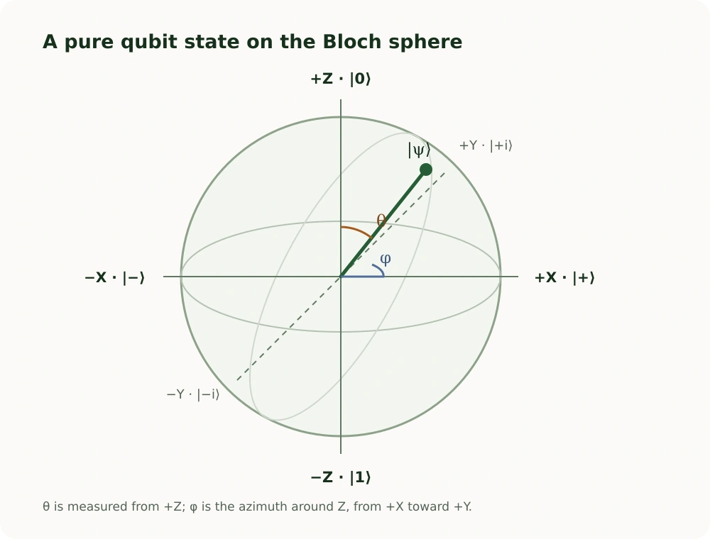

In [Part 1](/posts/classical-vs-quantum-logic-gates/), we compared Boolean gates with quantum gates and saw that a quantum gate transforms a state before measurement produces classical bits. The next question is more basic: what information is in that state?

The short notation is familiar by now: `|ψ⟩ = α|0⟩ + β|1⟩`. This article unpacks it. We will distinguish amplitudes from probabilities, see why phase matters even when immediate measurement odds do not change, and use the Bloch sphere to build a geometric model of a single qubit. You do not need quantum mechanics or linear algebra coursework to follow the ideas.

## A classical bit needs one value

A classical bit in the ordinary digital model has a definite value: `0` or `1`. Your program can read it, branch on it, or print it. The details of voltage ranges and noisy hardware sit below the abstraction; at the logic level, the value is enough to describe the bit.

A qubit is different because one value does not fully describe its state before measurement. We need amplitudes for the two computational-basis outcomes, and those amplitudes include phase information.

## A qubit needs more information

The computational-basis states are written `|0⟩` and `|1⟩`. A general pure state of one qubit is:

`|ψ⟩ = α|0⟩ + β|1⟩`

Here `α` and `β` are probability amplitudes. They can be complex numbers. A complex amplitude has a magnitude and a phase; the phase is not an extra label attached to a hidden classical value. It affects how this state combines with other amplitudes under later gates.

The basis states describe outcomes of a measurement in the **computational basis**, often called the Z basis. The state expression describes the qubit before that measurement. It is not a claim that the qubit secretly contains two readable classical values.

## Amplitudes are not probabilities

If we measure `|ψ⟩ = α|0⟩ + β|1⟩` in the computational basis, the Born rule gives:

`P(0) = |α|²` and `P(1) = |β|²`.

The bars mean magnitude. For a real amplitude such as `√0.75`, its magnitude squared is `0.75`. For a complex number, magnitude squared is still a nonnegative real number. The probabilities must sum to one, so a valid normalized state satisfies:

`|α|² + |β|² = 1`.

For example, consider `|ψ⟩ = √0.75|0⟩ + √0.25|1⟩`. A computational-basis measurement returns `0` with probability 75% and `1` with probability 25%. The amplitudes are not 75% and 25%; their squared magnitudes are those probabilities.

This distinction matters because probabilities do not carry all the information in a quantum state. Two states may have the same measurement probabilities in one basis and still respond differently to a later gate.

## Superposition is more than uncertainty

Suppose you have a classical bit whose value you have not looked up. You may assign a 50/50 probability that it is `0` or `1`, but that describes your uncertainty about a classical value. It does not describe a coherent quantum state.

A qubit can instead be prepared in a superposition such as `|+⟩ = (|0⟩ + |1⟩)/√2`. It gives the same 50/50 results in a computational-basis measurement, but the plus sign is part of the state. A classical 50/50 mixture has no corresponding relative phase for later operations to use. The difference becomes visible through interference, not by asking only for the immediate Z-basis probabilities.

Superposition is therefore not a useful synonym for “unknown.” It describes how amplitudes for possible outcomes coexist in the state and can combine under transformations. The outcome of one measurement is still one classical result.

## The famous 50/50 qubit

The Hadamard gate applied to `|0⟩` prepares:

`|+⟩ = (|0⟩ + |1⟩)/√2`.

In the computational basis, a measurement returns `0` or `1` with equal probability. The state `|−⟩ = (|0⟩ − |1⟩)/√2` produces the same immediate probabilities. If probabilities were a complete description, these states would seem identical. They are not.

The difference is the sign between the components. That sign is a simple example of **relative phase**. A later gate can make the two amplitudes reinforce or cancel differently, producing different measurement results. Part 1 used this with H: `H|+⟩ = |0⟩`, while `H|−⟩ = |1⟩`.

## Phase: information probability alone cannot show

Complex amplitudes carry magnitude and phase. In this article, you can think of phase as information about how a component will combine with another component when a gate brings paths together. It does not change every measurement probability directly. It changes the result of transformations that make amplitudes interact.

For the two states above, the amplitude magnitudes match. Only the relative sign differs. A sign change is a phase shift of π on one component relative to the other. The computational-basis probabilities before another operation remain 50/50, but the states can be distinguished by applying H and then measuring.

### Global phase and relative phase

There is also a phase change that does not matter physically for an isolated state. Multiplying the entire state by the same phase factor, `e^(iγ)`, gives `e^(iγ)|ψ⟩`. This is called **global phase**. It changes the written amplitudes together, leaving all observable outcome statistics unchanged.

**Relative phase** compares components within the state. In `(|0⟩ + |1⟩)/√2`, changing only the second component’s sign gives `(|0⟩ − |1⟩)/√2`. That is not a global phase: one component changed relative to the other. Relative phase can be revealed by a suitable sequence of gates and measurement. Put simply, a shared rotation of every amplitude is unobservable; changing their relationship can affect later interference.

## Interference: where phase becomes useful

Apply H to `|0⟩` and then apply H again:

```text
|0⟩  ──H──>  (|0⟩ + |1⟩)/√2  ──H──>  |0⟩
```

After the first H, a computational-basis measurement would be 50/50. But if we do not measure there and instead apply the second H, the state returns to `|0⟩` with certainty. H transforms amplitudes deterministically; it does not toss a coin.

The second gate combines contributions from both components. For the `|0⟩` outcome, the contributions add; for `|1⟩`, they cancel. The amplitudes interfere. Probabilities are calculated only after that combination, by taking squared magnitudes. This is why the sequence is not equivalent to generating a classical random bit and then making another independent random choice.

### Constructive and destructive interference

When paths in a quantum circuit contribute to the same possible outcome, their amplitudes can reinforce one another (constructive interference) or cancel (destructive interference). It is the amplitudes, including their relative phase, that combine. Probabilities do not cancel each other.

Quantum algorithms use gates to arrange these combinations. Depending on the algorithm, some outcomes become more likely and others less likely at measurement. There is no general process of “trying every answer and selecting the right one”; the transformations must exploit the structure of a particular problem.

## A qubit as a point on the Bloch sphere

For a pure single-qubit state, global phase can be set aside, leaving two useful real parameters. A conventional representation is:

`|ψ⟩ = cos(θ/2)|0⟩ + e^(iφ)sin(θ/2)|1⟩`.

The angle `θ` runs from the north pole toward the south pole. The angle `φ` goes around the equator and describes the relative phase. The half angles in sine and cosine are a mathematical convention that makes the sphere’s coordinates correspond neatly to quantum states; you do not need to derive them to use the picture.

The Bloch sphere represents a pure one-qubit state as a point on the sphere’s surface. It is a map of the state, not a tiny physical ball inside a device. The state’s direction summarizes both the measurement balance and the relative phase. The cover illustration introduces the idea; the diagram below labels the common reference states and angles.

<figure class="article-figure">



<figcaption>For pure states, θ sets the latitude and φ sets the direction around the Z axis. The X, Y, and Z labels identify different measurement bases.</figcaption>

</figure>

## Reading the Bloch sphere

The familiar basis states sit at the poles: `|0⟩` is at +Z and `|1⟩` is at −Z. The equal-amplitude states `|+⟩ = (|0⟩ + |1⟩)/√2` and `|−⟩ = (|0⟩ − |1⟩)/√2` lie at +X and −X. They have equal Z-basis probabilities, but occupy opposite points because their relative phases differ.

The Y axis captures another relative phase. With the usual convention, `|+i⟩ = (|0⟩ + i|1⟩)/√2` is +Y and `|−i⟩ = (|0⟩ − i|1⟩)/√2` is −Y. The imaginary unit `i` marks a quarter-turn of phase between the components. These states also give equal probabilities in the Z basis; a Y-basis measurement distinguishes them.

The angles are useful coordinates, not another kind of probability. At +Z, `θ = 0`; at −Z, `θ = π`. Around the equator, `θ = π/2`, while `φ` selects a direction: `0` gives +X and `π/2` gives +Y. At the poles, φ has no effect because one of the two amplitudes is zero.

## What the Bloch sphere does not mean

Every point on the surface represents a pure qubit state, up to global phase. Points inside the sphere represent mixed states when states are described with density matrices. A mixed state can arise from classical uncertainty about preparations or from looking at one part of a larger entangled system. We can keep that distinction in mind without learning density-matrix algebra here.

The diagram is also specific to a single qubit. For multiple qubits, each subsystem may have its own reduced state, but a general entangled joint state cannot be captured by a single point on one ordinary Bloch sphere. That is one reason multi-qubit quantum information needs a richer model.

## Quantum gates as rotations

Single-qubit gates can be visualized as rotations of the Bloch vector. The Pauli X, Y, and Z operations correspond to π rotations around the matching axes, up to an unobservable global phase in the rotation-operator convention. They move the represented state while preserving its purity in an ideal gate model.

Hadamard is not just “the superposition gate.” Geometrically, it swaps the X and Z directions and reverses Y; equivalently, it is a π rotation around the axis halfway between +X and +Z (again, ignoring global phase). In particular, it maps the north-pole state `|0⟩` to +X, `|+⟩`. This is the geometric version of `H|0⟩ = |+⟩`.

### Pauli-X revisited

On the computational basis, X exchanges `|0⟩` and `|1⟩`, which is why Part 1 compared it to NOT. On the sphere it flips the Z component and rotates every state by π around X. It therefore acts on arbitrary superpositions too; it does not inspect a bit and conditionally toggle it.

### Pauli-Z changes phase

Z leaves `|0⟩` alone and changes the sign of `|1⟩`: `Z|0⟩ = |0⟩`, `Z|1⟩ = −|1⟩`. Apply it to `|+⟩`:

`Z|+⟩ = (|0⟩ − |1⟩)/√2 = |−⟩`.

Before and after this operation, a Z-basis measurement is 50/50. The state still changed: its Bloch vector moved from +X to −X. An X-basis measurement distinguishes them, returning `+` with certainty for `|+⟩` and `−` with certainty for `|−⟩`. Same odds in one basis do not imply identical states.

## Measurement depends on the basis

The computational or Z basis asks whether the outcome is `|0⟩` or `|1⟩`. The X basis asks whether it is `|+⟩` or `|−⟩`. Measuring `|+⟩` in the Z basis gives 0 or 1 equally often; measuring that same state in the X basis returns `|+⟩` with certainty.

Many hardware interfaces expose computational-basis measurement directly. To measure in another basis, a circuit can first change basis and then perform the hardware measurement. For an X-basis measurement, applying H before a Z-basis measurement maps the X eigenstates to computational-basis states. Measurement is therefore a question asked in a chosen basis, not a peek at a basis-independent classical value stored in the qubit.

## Why you cannot just inspect a qubit

In Java, `System.out.println(value)` reads a variable without changing what it contains. There is no equivalent harmless operation that prints the complete unknown state of one qubit. Measurement returns an outcome in the chosen basis and changes the state according to that measurement. It does not reveal all amplitudes and phases from one specimen.

This does not mean quantum systems cannot be debugged. Simulators can expose idealized state information, and experiments can test circuits and compare observed distributions. But learning an unknown physical state requires repeated preparations and measurements, not passive inspection of a single qubit.

## Why many measurements are needed

One run, often called a shot, returns one classical outcome. Repeating the same preparation and circuit yields a sample distribution from which probabilities can be estimated. If a state produces `0` 600 times in 1,000 shots, that suggests a probability near 0.6, subject to statistical variation and hardware noise.

Those Z-basis counts alone do not reveal relative phase. Distinguishing states that share the same Z statistics requires applying transformations or measuring in additional bases. Quantum-state tomography generalizes this idea, but the practical lesson is enough here: measurement results are evidence about a state, not a full dump of it.

## A software engineer’s mental model

```text
classical: value → deterministic operation → inspect value
quantum:   state → unitary transformation → amplitudes and phase evolve
           → interference → measurement in a chosen basis → classical outcome
```

The quantum circuit is deterministic between measurements in the ideal model. Measurement produces outcomes probabilistically according to the state and chosen basis. Designing a quantum computation means arranging transformations so that interference makes useful outcomes more likely when the final measurement is made.

## Why this matters for quantum algorithms

Superposition alone is not a computational advantage. If we prepare a balanced state and measure immediately, we get a random-looking classical bit. The algorithmic work is in controlling relative phases and transformations so paths combine in a way that reveals useful structure in the output distribution.

This mental model prepares us to study algorithms such as Grover search and phase estimation without suggesting that a quantum processor simply evaluates all candidates and reads out every result. It also helps explain why a single-qubit state needs more than its current measurement odds: phase can affect what later gates make observable.

## Where this series goes next

We have focused on one qubit: its amplitudes, phase, geometric representation, and measurement. The next conceptual step is to ask what changes when multiple qubits share a joint state that cannot be described as independent single-qubit states. That leads naturally to entanglement and Bell states, without assuming that one Bloch sphere can represent the whole system.

For a deeper treatment, IBM Quantum Learning’s [Bloch sphere lesson](https://quantum.cloud.ibm.com/learning/en/courses/general-formulation-of-quantum-information/density-matrices/bloch-sphere) develops the state parameterization and mixed-state picture. Its [superposition lesson](https://quantum.cloud.ibm.com/learning/en/modules/quantum-mechanics/superposition-with-qiskit) visualizes single-qubit gates as sphere rotations, and the lesson on [global and relative phase](https://quantum.cloud.ibm.com/learning/en/courses/basics-of-quantum-information/quantum-circuits/limitations-on-quantum-information) shows why states with identical immediate probabilities can still be distinguished.
